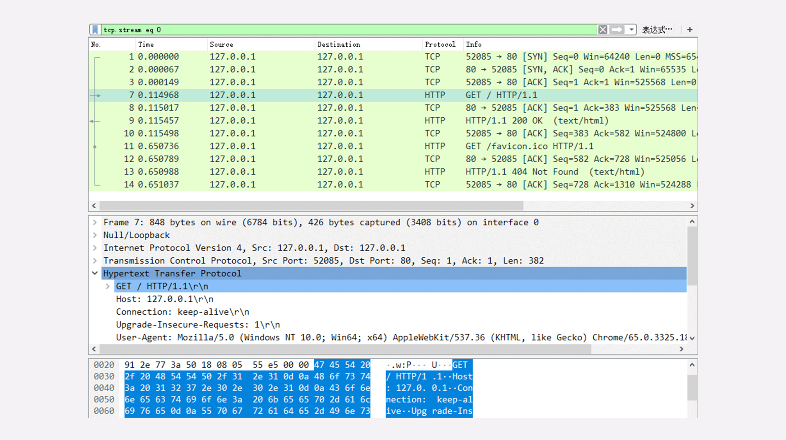
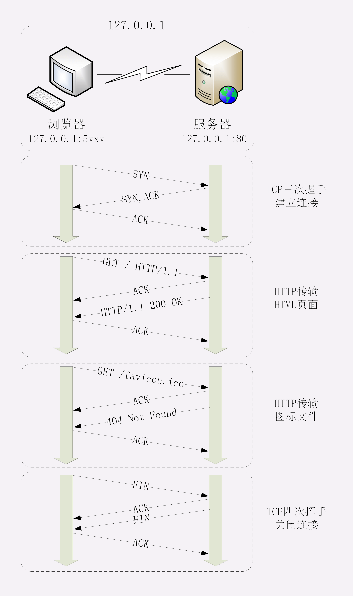

# 在浏览器输入地址按回车后发生了什么

## 1 使用 IP 地址访问 Web 服务器

### 1.1 抓包分析

打开 Wireshark，选择“HTTP TCP port(80)”过滤器，再鼠标双击“Npcap loopback Adapter”，开始抓取本机 127.0.0.1 地址上的网络数据。

在 Chrome 浏览器的地址栏里输入“http://127.0.0.1/”，再按下回车键，等欢迎页面显示出来后 Wireshark 里就会有捕获的数据包，如下图所示。

在 Wireshark 里你可以看到，这次一共抓到了 11 个包（这里用了滤包功能，滤掉了 3 个包，原本是 14 个包），耗时 0.65 秒

### 1.2 TCP 三次握手

HTTP 协议是运行在 TCP/IP 基础上的，依靠 TCP/IP 协议来实现数据的可靠传输。所以浏览器要用 HTTP 协议收发数据，首先要做的就是建立 TCP 连接。

因为我们在地址栏里直接输入了 IP 地址“127.0.0.1”，而 Web 服务器的默认端口是 80，所以浏览器就要依照 TCP 协议的规范，使用“三次握手”建立与 Web 服务器的连接。

对应到 Wireshark 里，就是最开始的三个抓包，浏览器使用的端口是 52085，服务器使用的端口是 80，经过 SYN、SYN/ACK、ACK 的三个包之后，浏览器与服务器的 TCP 连接就建立起来了。

### 1.3 传输数据

有了可靠的 TCP 连接通道后，HTTP 协议就可以开始工作了。于是，浏览器按照 HTTP 协议规定的格式，通过 TCP 发送了一个“GET / HTTP/1.1”请求报文，也就是 Wireshark 里的第四个包。至于包的内容具体是什么现在先不用管，我们下一讲再说。

随后，Web 服务器回复了第五个包，在 TCP 协议层面确认：“刚才的报文我已经收到了”，不过这个 TCP 包 HTTP 协议是看不见的。

Web 服务器收到报文后在内部就要处理这个请求。同样也是依据 HTTP 协议的规定，解析报文，看看浏览器发送这个请求想要干什么。

它一看，原来是要求获取根目录下的默认文件，好吧，那我就从磁盘上把那个文件全读出来，再拼成符合 HTTP 格式的报文，发回去吧。这就是 Wireshark 里的第六个包“HTTP/1.1 200 OK”，底层走的还是 TCP 协议。

同样的，浏览器也要给服务器回复一个 TCP 的 ACK 确认，“你的响应报文收到了，多谢。”，即第七个包。

这时浏览器就收到了响应数据，但里面是什么呢？所以也要解析报文。一看，服务器给我的是个 HTML 文件，好，那我就调用排版引擎、JavaScript 引擎等等处理一下，然后在浏览器窗口里展现出了欢迎页面。

这之后还有两个来回，共四个包，重复了相同的步骤。这是浏览器自动请求了作为网站图标的“favicon.ico”文件，与我们输入的网址无关。但因为我们的实验环境没有这个文件，所以服务器在硬盘上找不到，返回了一个“404 Not Found”。

至此，“键入网址再按下回车”的全过程就结束了。

下面是一个过程交互图。不过图里 TCP 关闭连接的“四次挥手”在抓包里没有出现，这是因为 HTTP/1.1 长连接特性，默认不会立即关闭连接。

再简要叙述一下这次最简单的浏览器 HTTP 请求过程：

1. 浏览器从地址栏的输入中获得服务器的 IP 地址和端口号；
2. 浏览器用 TCP 的三次握手与服务器建立连接；
3. 浏览器向服务器发送拼好的报文；
4. 服务器收到报文后处理请求，同样拼好报文再发给浏览器；
5. 浏览器解析报文，渲染输出页面。

## 2 使用域名访问

域名访问需要先访问本地的 host 缓存和域名服务器获取服务器的 IP 地址

例如，你要访问 `www.apple.com`，就要进行下面的三次查询：

1. 访问根域名服务器，它会告诉你“com”顶级域名服务器的地址；
2. 访问“com”顶级域名服务器，它再告诉你“apple.com”域名服务器的地址；
3. 最后访问“apple.com”域名服务器，就得到了“www.apple.com”的地址。

## 3 真实的网络访问

真实的互联网世界要比这两个场景要复杂的多，我利用下面的这张图来做一个详细的说明。

如果你用的是电脑台式机，那么你可能会使用带水晶头的双绞线连上网口，由交换机接入固定网络。如果你用的是手机、平板电脑，那么你可能会通过蜂窝网络、WiFi，由电信基站、无线热点接入移动网络。

接入网络的同时，网络运行商会给你的设备分配一个 IP 地址，这个地址可能是静态分配的，也可能是动态分配的。静态 IP 就始终不变，而动态 IP 可能你下次上网就变了。

假设你要访问的是 Apple 网站，显然你是不知道它的真实 IP 地址的，在浏览器里只能使用域名“www.apple.com”访问，那么接下来要做的必然是域名解析。这就要用 DNS 协议开始从操作系统、本地 DNS、根 DNS、顶级 DNS、权威 DNS 的层层解析，当然这中间有缓存，可能不会费太多时间就能拿到结果。

### 3.1 CDN

DNS 解析可能会给出 CDN 服务器的 IP 地址，这样你拿到的就会是 CDN 服务器而不是目标网站的实际地址。

因为 CDN 会缓存网站的大部分资源，比如图片、CSS 样式表，所以有的 HTTP 请求就不需要再发到 Apple，CDN 就可以直接响应你的请求，把数据发给你。

由 PHP、Java 等后台服务动态生成的页面属于“动态资源”，CDN 无法缓存，只能从目标网站获取。于是你发出的 HTTP 请求就要开始在互联网上的“漫长跋涉”，经过无数的路由器、网关、代理，最后到达目的地。

### 3.2 负载均衡

目标网站的服务器对外表现的是一个 IP 地址，但为了能够扛住高并发，在内部也是一套复杂的架构。通常在入口是负载均衡设备，例如四层的 LVS 或者七层的 Nginx，在后面是许多的服务器，构成一个更强更稳定的集群。

负载均衡设备会先访问系统里的缓存服务器，通常有 memory 级缓存 Redis 和 disk 级缓存 Varnish，它们的作用与 CDN 类似，不过是工作在内部网络里，把最频繁访问的数据缓存几秒钟或几分钟，减轻后端应用服务器的压力。

如果缓存服务器里也没有，那么负载均衡设备就要把请求转发给应用服务器了。这里就是各种开发框架大显神通的地方了，例如 Java 的 Tomcat/Netty/Jetty，Python 的 Django，还有 PHP、Node.js、Golang 等等。它们又会再访问后面的 MySQL、PostgreSQL、MongoDB 等数据库服务，实现用户登录、商品查询、购物下单、扣款支付等业务操作，然后把执行的结果返回给负载均衡设备，同时也可能给缓存服务器里也放一份。

应用服务器的输出到了负载均衡设备这里，请求的处理就算是完成了，就要按照原路再走回去，还是要经过许多的路由器、网关、代理。如果这个资源允许缓存，那么经过 CDN 的时候它也会做缓存，这样下次同样的请求就不会到达源站了。

## 4 总结

1. HTTP 协议基于底层的 TCP/IP 协议，所以必须要用 IP 地址建立连接；
2. 如果不知道 IP 地址，就要用 DNS 协议去解析得到 IP 地址，否则就会连接失败；
3. 建立 TCP 连接后会顺序收发数据，请求方和应答方都必须依据 HTTP 规范构建和解析报文；
4. 为了减少响应时间，整个过程中的每一个环节都会有缓存，能够实现“短路”操作；
5. 虽然现实中的 HTTP 传输过程非常复杂，但理论上仍然可以简化成实验里的“两点”模型。

## 5 扩展问题

1. 你能试着解释一下在浏览器里点击页面链接后发生了哪些事情吗？
2. 这一节课里讲的都是正常的请求处理流程，如果是一个不存在的域名，那么浏览器的工作流程会是怎么样的呢？
