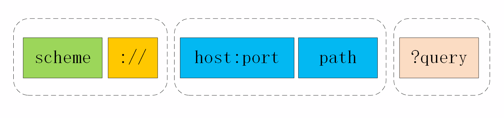
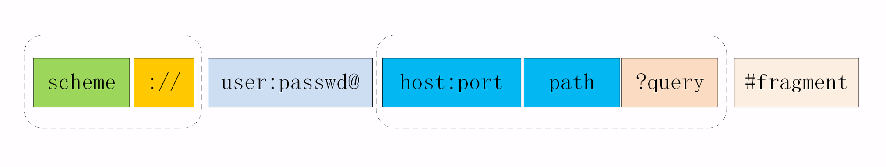

# URI 格式

上一讲里我们一起学习了 HTTP 协议里的请求方法，其中最常用的一个是 GET，它用来从服务器上某个资源获取数据，另一个是 POST，向某个资源提交数据。

我们常用 GET 请求来获取某个服务器上的某个资源，那么，应该用什么来标记服务器上的资源呢？怎么区分“这个”资源和“那个”资源呢？

那就是 URI，也就是统一资源标识符（Uniform Resource Identifier）。因为它经常出现在浏览器的地址栏里，所以俗称为“网络地址”，简称“网址”。

严格地说，URI 不完全等同于网址，它包含有 URL 和 URN 两个部分，在 HTTP 世界里用的网址实际上是 URL——统一资源定位符（Uniform Resource Locator）。但因为 URL 实在是太普及了，所以常常把这两者简单地视为相等。

## 1 URI 的格式

URI 本质上是一个字符串，这个字符串的作用是唯一地标记资源的位置或者名字。

需要注意的是，它不仅能够标记万维网的资源，也可以标记其他的，如邮件系统、本地文件系统等任意资源。而“资源”既可以是存在磁盘上的静态文本、页面数据，也可以是由 Java、PHP 提供的动态服务。

下面的这张图显示了 URI 最常用的形式，由 scheme、host:port、path 和 query 四个部分组成，但有的部分可以视情况省略。



## 2 URI 的基本组成

URI 第一个组成部分叫 scheme，翻译成中文叫“方案名”或者“协议名”，表示资源应该使用哪种协议来访问。

最常见的当然就是“http”了，表示使用 HTTP 协议。另外还有“https”，表示使用经过加密、安全的 HTTPS 协议。此外还有其他不是很常见的 scheme，例如 ftp、ldap、file、news 等。

浏览器或者你的应用程序看到 URI 里的 scheme，就知道下一步该怎么走了，会调用相应的 HTTP 或者 HTTPS 下层 API。显然，如果一个 URI 没有提供 scheme，即使后面的地址再完善，也是无法处理的。

在 scheme 之后，必须是三个特定的字符“://”，它把 scheme 和后面的部分分离开。

在“://”之后，是被称为“authority”的部分，表示资源所在的主机名，通常的形式是“host:port”，即主机名加端口号。

主机名可以是 IP 地址或者域名的形式，必须要有，否则浏览器就会找不到服务器。但端口号有时可以省略，浏览器等客户端会依据 scheme 使用默认的端口号，例如 HTTP 的默认端口号是 80，HTTPS 的默认端口号是 443。

有了协议名和主机地址、端口号，再加上后面标记资源所在位置的 path，浏览器就可以连接服务器访问资源了。

这里我也要再次提醒你注意，URI 的 path 部分必须以“/”开始，也就是必须包含“/”，不要把“/”误认为属于前面 authority。

需要注意的是 file 协议：

```
file:///D:/http_study/www/
```

它的协议名不是“http”，而是“file”，表示这是本地文件，而后面居然有三个斜杠

这三个斜杠里的前两个属于 URI 特殊分隔符“://”，然后后面的“/D:/http_study/www/”是路径，而中间的主机名被“省略”了。这实际上是 file 类型 URI 的“特例”，它允许省略主机名，默认是本机 localhost。

## 3 URI 的查询参数

使用“协议名 + 主机名 + 路径”的方式，已经可以精确定位网络上的任何资源了。但这还不够，很多时候我们还想在操作资源的时候附加一些额外的修饰参数。

举几个例子：获取商品图片，但想要一个 32×32 的缩略图版本；获取商品列表，但要按某种规则做分页和排序；跳转页面，但想要标记跳转前的原始页面。

仅用“协议名 + 主机名 + 路径”的方式是无法适应这些场景的，所以 URI 后面还有一个“query”部分，它在 path 之后，用一个“?”开始，但不包含“?”，表示对资源附加的额外要求。这是个很形象的符号，比“://”要好的多，很明显地表示了“查询”的含义。

查询参数 query 有一套自己的格式，是多个“key=value”的字符串，这些 KV 值用字符“&”连接，浏览器和客户端都可以按照这个格式把长串的查询参数解析成可理解的字典或关联数组形式。

例如：

```
https://search.jd.com/Search?keyword=openresty&enc=utf-8&qrst=1&rt=1&stop=1&vt=2&wq=openresty&psort=3&click=0
```

## 4 URI 的完整格式

URI 还有一个“真正”的完整形态，如下图所示。



这个“真正”形态比基本形态多了两部分。

第一个多出的部分是协议名之后、主机名之前的身份信息“user:passwd@”，表示登录主机时的用户名和密码，但现在已经不推荐使用这种形式了（RFC7230），因为它把敏感信息以明文形式暴露出来，存在严重的安全隐患。

第二个多出的部分是查询参数后的片段标识符“#fragment”，它是 URI 所定位的资源内部的一个“锚点”或者说是“标签”，浏览器可以在获取资源后直接跳转到它指示的位置。

但片段标识符仅能由浏览器这样的客户端使用，服务器是看不到的。也就是说，浏览器永远不会把带“#fragment”的 URI 发送给服务器，服务器也永远不会用这种方式去处理资源的片段。

## 5 URI 的编码

刚才我们看到了，在 URI 里只能使用 ASCII 码，但如果要在 URI 里使用英语以外的汉语、日语等其他语言该怎么办呢？

还有，某些特殊的 URI，会在 path、query 里出现“@&?"等起界定符作用的字符，会导致 URI 解析错误，这时又该怎么办呢？

所以，URI 引入了编码机制，对于 ASCII 码以外的字符集和特殊字符做一个特殊的操作，把它们转换成与 URI 语义不冲突的形式。这在 RFC 规范里称为“escape”和“unescape”，俗称“转义”。

URI 转义的规则有点“简单粗暴”，直接把非 ASCII 码或特殊字符转换成十六进制字节值，然后前面再加上一个“%”。

例如，空格被转义成“%20”，“?”被转义成“%3F”。而中文、日文等则通常使用 UTF-8 编码后再转义，例如“银河”会被转义成“%E9%93%B6%E6%B2%B3”。

有了这个编码规则后，URI 就更加完美了，可以支持任意的字符集用任何语言来标记资源。

## 6 总结

1. URI 是用来唯一标记服务器上资源的一个字符串，通常也称为 URL；
2. URI 通常由 scheme、host:port、path 和 query 四个部分组成，有的可以省略；
3. scheme 叫“方案名”或者“协议名”，表示资源应该使用哪种协议来访问；
4. “host:port”表示资源所在的主机名和端口号；
5. path 标记资源所在的位置；
6. query 表示对资源附加的额外要求；
7. 在 URI 里对“@&/”等特殊字符和汉字必须要做编码，否则服务器收到 HTTP 报文后会无法正确处理。

## 7 扩展问题

1. HTTP 协议允许在在请求行里使用完整的 URI，但为什么浏览器没有这么做呢？
2. URI 的查询参数和头字段很相似，都是 key-value 形式，都可以任意自定义，那么它们在使用时该如何区别呢？
