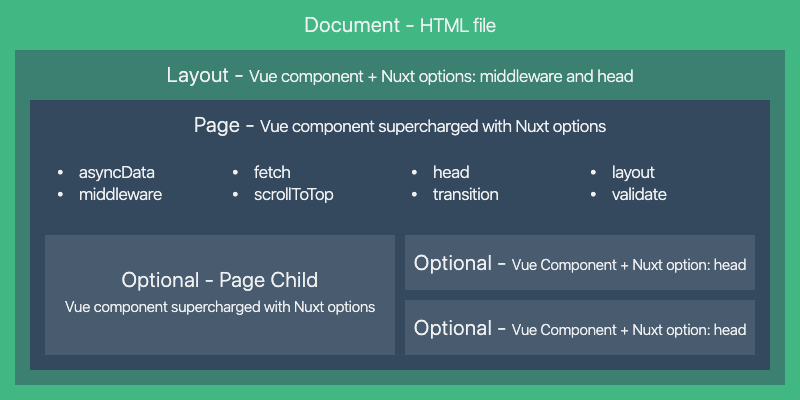

# View

本章节的内容阐述了如何在 `Nuxt.js` 应用中为指定的路由配置数据和视图，包括应用模板、页面、布局和 HTML 头部等内容

Nuxt 中的 `View` 组成:



## 1 page

页面组件实际上是 Vue 组件，只不过 `Nuxt.js` 为这些组件添加了一些特殊的配置项（对应 `Nuxt.js` 提供的功能特性）

例如：`asyncData`, `fetch`, `head`, `layout`, `middleware`, `scrollToTop`, `transition`, `validate`

## 2 layout

`Nuxt.js` 允许你扩展默认的布局，或在 `layout` 目录下创建自定义的布局

例如，添加侧边栏或为移动设备和桌面设备设置不同的布局

### 2.1 默认布局

可通过添加 `layouts/default.vue` 文件来扩展应用的默认布局

> 别忘了在布局文件中添加 `<nuxt/>` 组件用于显示页面的主体内容

### 2.2 自定义布局

`layouts` 目录中的每个文件都将创建一个可通过页面组件中的 `layout` 属性访问的自定义布局

例如创建一个博客布局：

```vue
<template>
  <div>
    <div>My blog navigation bar here</div>
    <Nuxt />
  </div>
</template>
```

然后我们必须告诉页面使用某个自定义布局：

```vue
<template>
  <!-- Your template -->
</template>
<script>
export default {
  layout: 'blog'
  // page component definitions
};
</script>
```

## 3 错误页面

可以通过编辑 `layouts/error.vue` 文件来定制化错误页面

> 虽然此文件放在 `layouts` 文件夹中, 但应该将它看作是一个页面。这个布局文件不需要包含 `<nuxt/>` 标签

```vue
<template>
  <div class="container">
    <h1 v-if="error.statusCode === 404">页面不存在</h1>
    <h1 v-else>应用发生错误异常</h1>
    <nuxt-link to="/">首 页</nuxt-link>
  </div>
</template>

<script>
export default {
  props: ['error'],
  layout: 'blog' // 你可以为错误页面指定自定义的布局
};
</script>
```

## 4 模板

可以定制化 `Nuxt.js` 默认的应用模板

定制化默认的 `html` 模板，只需要在 `src` 文件夹下（默认是应用根目录）创建一个 `app.html` 的文件

Nuxt 使用的默认模板是：

```html
<!DOCTYPE html>
<html {{ HTML_ATTRS }}>
  <head {{ HEAD_ATTRS }}>
    {{ HEAD }}
  </head>
  <body {{ BODY_ATTRS }}>
    {{ APP }}
  </body>
</html>
```
