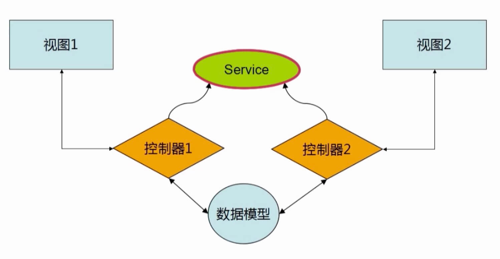

# angular

## mvc

### controller

controller使用过程中的注意点

* 不要试图复用controller,一个控制器一般只负责一小快视图
* 不要在controller中操作DOM，这个不是控制器的职责
* 不要在controller中里面做数据格式化，ng有很好用的表单控件
* 不要在controller里面做数据过滤操作，ng有$filter服务
* 一般来说，controller是不会互相调用的，控制器之间的交互会通过事件进行

第1章 课程预热
1-1 为什么是全栈最后一公里
1-2 搭建线上生产环境需要做什么

第2章 待部署的5个本地nodejs项目
2-1 快速本地搭建一个纯静态简易站点
2-2 nodejs电影网站项目上线准备
2-3 狗狗说react native开发的App后台
2-4 微信小程序的项目介绍
2-5 电影微信公众号的项目概况
2-6 从一个故事理解整个部署思路

第3章 选购域名服务器及备案
3-1 选购域名的经验分享
3-2 主机厂商对比及选购阿里云主机
3-3 域名备案流程

第4章 远程登录服务器
4-1 第一次SSH远程登录服务器
4-2 配置root及应用账号权限
4-3 配置本地无密码SSH登录

第5章 增强服务器安全等级
5-1 修改服务器默认登录端口
5-2 配置iptables和Fail2Ban增强安全防护

第6章 搭建nodejs生产环境
6-1 搭建服务器的nodejs环境
6-2 借助pm2让nodejs服务常驻

第7章 配置Nginx实现反向代理
7-1 配置Nginx反向代理Nodejs端口

第8章 利用DNSPod管理域名解析
8-1 更改域名的DNS根服务器
8-2 配置解析项目的域名A记录和CNAME

第9章 服务器配置及安装MongoDB
9-1 在Ubuntu上安装MongoDB
9-2 往线上MongoDB导入单表数据
9-3 为上线项目配置MongoDB数据库
9-4 从一台服务器迁移数据到另一个线上服务器
9-5 为数据库实现定时备份方案
9-6 上传数据库备份到七牛私有云

第10章 向服务器正式部署
10-1 上传项目代码到线上私有Git仓库
10-2 配置PM2一键部署线上项目结构
10-3 从本地发布上线和更新服务器
10-4 部署发布电影网站并连接线上MongoDB
10-5 部署ReactNative App线上API服务
10-6 部署微信小程序线上API服务
10-7 部署配置微信公众号项目后台

第11章 使用和配置更安全的HTTPS协议
11-1 选购申请SSL证书的一些建议
11-2 云平台申请免费证书及Nginx配置
11-3 聊一聊运维安全和应对思路