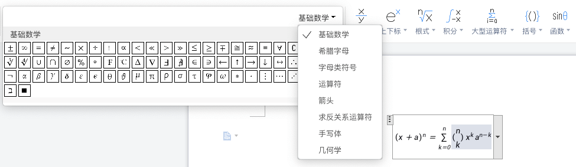
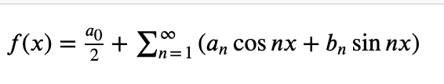
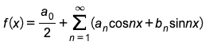

# 数学公式解析

在 word 中可以很方便的插入数学公式，那么网页中如何渲染数学公式呢



## 1 mathml

MathML 是数学标记语言，是一种基于 XML（标准通用标记语言的子集）的标准，用来在互联网上书写数学符号和公式的置标语言

HTML5 可以在文档中使用 MathML 元素，对应的标签是 `<math>...</math>`

如下面展示一个公式：

```html
<math xmlns="http://www.w3.org/1998/Math/MathML">
  <mi>f</mi>
  <mo>(</mo>
  <mi>x</mi>
  <mo>)</mo>
  <mo>=</mo>
  <mfrac>
    <msub>
      <mi>a</mi>
      <mn>0</mn>
    </msub>
    <mn>2</mn>
  </mfrac>
  <mo>+</mo>
  <munderover>
    <mo>&#x2211;</mo>
    <mrow>
      <mi>n</mi>
      <mo>=</mo>
      <mn>1</mn>
    </mrow>
    <mo>&#x221E;</mo>
  </munderover>
  <mrow>
    <mo>(</mo>
    <msub>
      <mi>a</mi>
      <mi>n</mi>
    </msub>
    <mi>cos</mi>
    <mi>n</mi>
    <mi>x</mi>
    <mo>+</mo>
    <msub>
      <mi>b</mi>
      <mi>n</mi>
    </msub>
    <mi>sin</mi>
    <mi>n</mi>
    <mi>x</mi>
    <mo>)</mo>
  </mrow>
</math>
```



> 不过 mathml 目前只有 firefox 支持，其他浏览器还是需要通过插件渲染

## 2 LaTeX

LaTeX 是一种基于 ΤΕΧ 的排版系统，适合用来生成复杂表格和数学公式

下面就是一个 LaTeX 格式的公式：

```
f(x)=\frac{a_0}2+\sum_{n=1}^\infty{(a_n\cos nx+b_n\sin nx)}
```



不过浏览器无法直接解析 LaTeX 公式，在浏览器展示公式还是需要工具渲染

将公式转成 html 或者 svg，并且需要添加相应的样式才能正常的将公式展示出来

常用的工具有：

- Mathjax [https://www.mathjax.org/](https://www.mathjax.org/)
- katex [https://katex.org/](https://katex.org/)

优缺点：

- Mathjax 有着更全面的解析，但却丧失了体积轻量这一优势
- KaTex 则更加灵活，以高速渲染为优势
