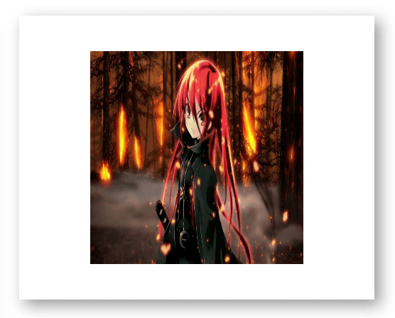

# 前端压缩图片

## 前言

开发编程平台的时，有个需求是保存作品时提交作品的截图，在 firefox 下面拿到的图片会比较大，超过了后台设的限制，后端大佬想前端去压缩～

不过这个场景前端压缩还是比较适合，需求上对图片质量要求不高。一是可以减小上传图片的大小，二是统一上传图片的尺寸。

前端压缩图片是有损压缩，对压缩要求比较高的话最好放到后端（可能前端也有比较好的压缩工具～）。

## 实现原理

要想前端实现图片的压缩效果，原理其实很简单，核心 API 就是使用 canvas 的 drawImage()方法。先来看一下需要用到的 api

### Image

Image() 函数将会创建一个新的 HTMLImageElement 实例。

它的功能等价于 document.createElement('img')

**语法：**

```javascript
let img = new Image();
img.src = ''; // 图片地址/base64;

img.onload = () => {
  // do something
};
```

### ctx.drawImage

如方法名，即在 canvas 上绘制图片。

**语法：**

```javascript
void ctx.drawImage(image, dx, dy);
void ctx.drawImage(image, dx, dy, dWidth, dHeight);
void ctx.drawImage(image, sx, sy, sWidth, sHeight, dx, dy, dWidth, dHeight);
```

**参数：**

- `image` 绘制到上下文的元素
- `sx` image 的矩形（裁剪）选择框的左上角 X 轴坐标
- `sy` image 的矩形（裁剪）选择框的左上角 Y 轴坐标
- `sWidth` image 的矩形（裁剪）选择框的宽度
- `sHeight` image 的矩形（裁剪）选择框的高度
- `dx` image 的左上角在目标 canvas 上 X 轴坐标
- `dy` image 的左上角在目标 canvas 上 Y 轴坐标
- `dWidth` image 在目标 canvas 上绘制的宽度。 允许对绘制的 image 进行缩放。 如果不说明， 在绘制时 image 宽度不会缩放
- `dHeight` image 在目标 canvas 上绘制的高度

这几个参数说明一下，参数的使用必须参照上面的例子，即必须是 3/5/9 个参数。

**举例：**

原图大小为 1366 \* 768，canvas 大小为 500 \* 400


**3 个参数**

```javascript
context.drawImage(img, 20, 20);
```

效果如下图：


图片从 canvas 的左上角 20px 处开始渲染，图片只显示左上角的一部分。

**5 个参数**

```javascript
context.drawImage(img, 100, 50, 300, 300);
```



指定了图片在画布中的位置和图片在画布中的大小，上面指定的是 300\*300，可以看到图片被缩小和压缩了

**9 个参数**

```javascript
context.drawImage(img, 420, 0, 500, 500, 100, 50, 300, 300);
```


上面的参数表示从图片的 (420, 0) 处截取 500\*500 大小的图片在 canvas 的 (100, 500) 以 300\*300 大小进行绘制

### canvas.toDataURL

将 canvas 转图片，返回 base64

**语法：**

```javascript
canvas.toDataURL(type, encoderOptions);
```

**参数：**

- `type` 图片格式，默认为 image/png
- `encoderOptions` 在指定图片格式为 image/jpeg 或 image/webp 的情况下，可以从 0 到 1 的区间内选择图片的质量。如果超出取值范围，将会使用默认值 0.92。其他参数会被忽略

## 代码

了解原理后，代码也很简单～

```javascript
/**
 * @desc 返回指定大小的图片
 */
function minImg({ imgBase64, width, height, type = 'image/jpeg', quality = '0.92' }) {
  return new Promise((resolve, reject) => {
    try {
      const img = new Image();
      const canvas = document.createElement('canvas');
      const context = canvas.getContext('2d');

      canvas.width = width;
      canvas.height = height;
      img.src = imgBase64;

      img.onload = () => {
        context.drawImage(img, 0, 0, width, height);
        const res = canvas.toDataURL(type, quality);
        resolve(res);
      };
    } catch (err) {
      reject(err);
    }
  });
}
```
