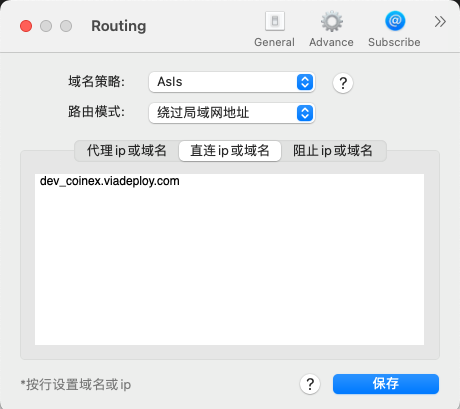

# mac 安装 nginx

参考：

[掘金：Mac 安装Nginx详细教程](https://juejin.cn/post/6986190222241464350#heading-4)

如果使用了代理，nginx 配的域名可能会被重定向到代理的地址

v2ray 更改配置：



更改 hosts：

```
127.0.0.1 test.lalala.com
```

如果浏览器报错 `net::ERR_CONTENT_LENGTH_MISMATCH` 可能是 nginx 没有权限

参考：

[掘金：浏览器报错](https://juejin.cn/post/7085588832522862600)