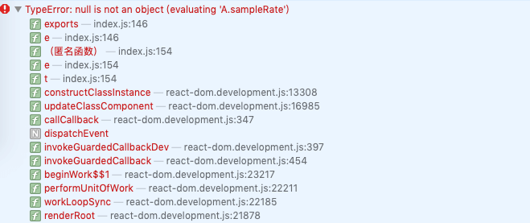
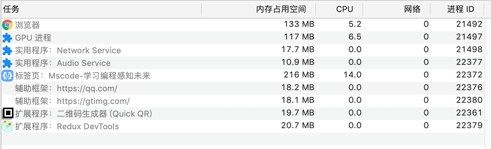
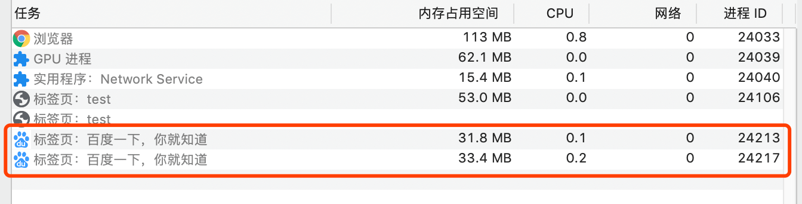
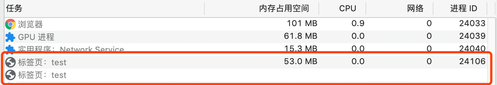
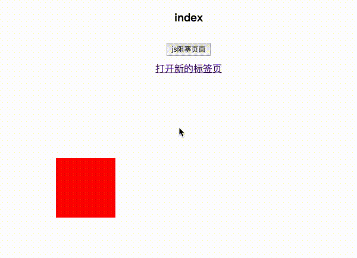
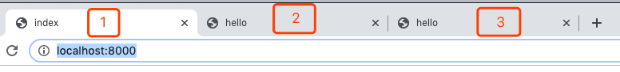
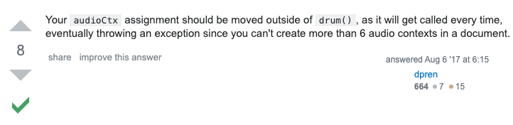

# 多页面共用进程问题

最近开发的编程平台项目出现过一个怪异的问题，在作品详情和编辑器页面，会偶现页面崩溃的问题。报一个错误，如下：



经过一段时间的观察，找到了这个问题出现的规律：打开第 5 个作品详情页面时就会出现这个错误。

那么为什么打开第五个标签就会出现这个错误，并且只有在标签内打开新的标签才会出现这个问题，而手动新建标签再输地址打开的页面不会出现问题？

这需要从进程和线程说起～

## 1 进程和线程

- 进程是 cpu 资源分配的最小单位（是能拥有资源和独立运行的最小单位）
- 线程是 cpu 调度的最小单位（线程是建立在进程的基础上的一次程序运行单位，一个进程中可以有多个线程）

进程和线程的特点：

- 进程中任意线程出错，都会导致进程崩溃
- 线程之间可以共享进程中的数据
- 一个进程关闭后，操作系统会回收其内存
- 进程之间内容相互隔离，避免互相影响

## 2 chrome 的进程

浏览器是多进程的

浏览器之所以能够运行，是因为系统给它的进程分配了资源（cpu、内存）

**一般**情况每打开一个 Tab 页，就相当于创建了一个独立的浏览器进程（也有多标签属于同一个进程的情况）。

**Chrome 包括的进程：**

- 浏览器进程：负责界面显示、用户交互、子进程管理等功能
- 渲染进程：负责解析 html,css,js；排版引擎 Blink 与 JS 的 V8 引擎都在该进程中；运行在沙箱模式下
- GPU 进程：独立于其他进程，专用于处理 GPU 任务，比如 webgl 渲染，css3 动画
- 网络进程：负责页面网络资源加载
- 插件进程：负责插件的运行，插件易崩溃，所以隔离出来



**浏览器多进程的优势：**

- 避免单个页面崩溃影响整个浏览器
- 避免第三方插件奔溃影响整个浏览器
- 多进程充分利用多核优势
- 方便使用沙盒模型隔离插件等进程，提高浏览器稳定性

## 3 渲染进程

详情看这篇文章：[https://juejin.im/post/5a6547d0f265da3e283a1df7](https://juejin.im/post/5a6547d0f265da3e283a1df7)

页面的渲染，JS 的执行，事件的循环，都在渲染进程内进行，浏览器的渲染进程是多线程的。

渲染进程有以下主要的线程：

- GUI 渲染线程
- JS 引擎线程，GUI 渲染线程与 JS 引擎线程是互斥的，一个 Tab 页（renderer 进程）中无论什么时候都只有一个 JS 线程在运行 JS 程序
- 事件触发线程
- 定时触发器线程
- 异步 http 请求线程

## 4 多标签共用进程的情况

一般情况下，每打开一个浏览器标签页（手动打开新标签，通过在地址栏输入 URL），会新开一个独立进程，即使两个标签页打开的是同一个页面。



(可以看到打开的是同一个页面，但是分配了两个进程)

但是通过一个标签页打开另一个标签页时，会将两个标签共用一个进程。

比如：

- 指定了 target="\_blank" 的 a 标签（同源的地址）
- window.open()（同源的地址）
- iframe 内嵌页面（同源的 iframe 不会分配新的进程，而非同源 iframe 页面作为一个“辅助框架”，会分配一个独立进程）



(这两个页面共用了一个进程)

> 那么为什么会出现这种情况呢？当一个标签页打开另一个标签页时，这两个标签可能需要互相通信（可以通过 window.opener 获取父页面的全局对象），那么新标签页就不能运行在独立的进程中

如何避免共用进程的情况呢？下面摘抄自 MDN 关于 a 标签的文档:

> Note: Linking to another page using target="\_blank" will run the new page on the same process as your page. If the new page is executing expensive JS, your page's performance may suffer. To avoid this use rel=noopener.

在 a 标签上加上 rel=noopener 就可以在打开新标签时新分配一个进程。

> 经过测试，这个属性在 chrome 和 firefox 上表现正常，在 safari 上无效

### 4.1 共用进程造成页面阻塞的情况

多标签共用一个进程肯定是有隐患的，假如其中一个页面有很大的计算量，那么就可能会造成页面卡顿，并且影响的是所有共用这一个进程的页面。

下面参考一个实例：



上图中点击 "js 阻塞页面" 会执行一个死循环卡死页面，红色的方块是一个 css 动画。

现在打开 3 个标签页，其中 1、2 为同一个进程，3 为独立的进程。



让 js 阻塞页面后，观察实验结果：

- 1 页面动画停止
- 2 页面动画停止
- 3 页面动画正常

## 5 AudioContext 的实例数量限制

回到编程平台出现的那个问题。

通过错误提示，顺着找到了错误的原因，是由于 AudioContext 创建的实例为 null 造成的。

通过上面介绍的浏览器进程和线程的特性，猜测出现这个问题是由于多标签共用进程造成的。也就是说在同一个进程内创建 AudioContext 的实例有数量限制。

找了一些资料，并没有找到比较官方的说明，只找到一个类似问题的回答：



那么就需要测试一下：

```javascript
// 创建 AudioContext 实例，并创建 buffer
function createContext() {
  let Context = window.AudioContext || window.webkitAudioContext;
  let context = new Context();
  let buffer = context.createBuffer(1, 1, context.sampleRate);
  let source = context.createBufferSource();

  source.buffer = buffer;
  source.connect(context.destination);
  source.start(0);
}
```

测试结果：

- chrome 可以创建 1 千个以上的实例（可能无限制）
- firefox 同 chrome
- safari 最多创建 4 个实例

经过测试，可以确定造成这个看起来很怪异的问题的原因就是： safari 在一个进程内最多只能创建 4 个 AudioContext 实例，多于 4 个则返回 null

参考资料：

- [https://juejin.im/post/5a6547d0f265da3e283a1df7](https://juejin.im/post/5a6547d0f265da3e283a1df7)
- [https://juejin.im/post/5d5a330ae51d453bdb1d9b4e](https://juejin.im/post/5d5a330ae51d453bdb1d9b4e)
- [https://juejin.im/post/5bd7c761518825292d6b0217](https://juejin.im/post/5bd7c761518825292d6b0217)
- [https://developer.mozilla.org/zh-CN/docs/Web/API/AudioContext](https://developer.mozilla.org/zh-CN/docs/Web/API/AudioContext)
