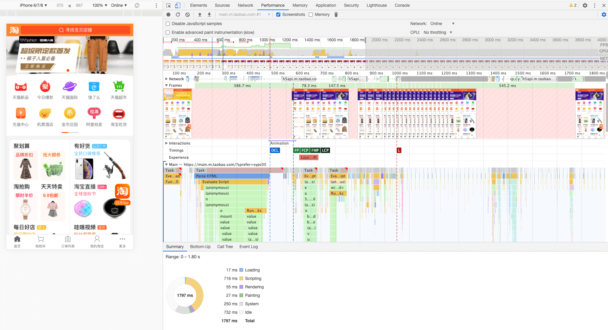
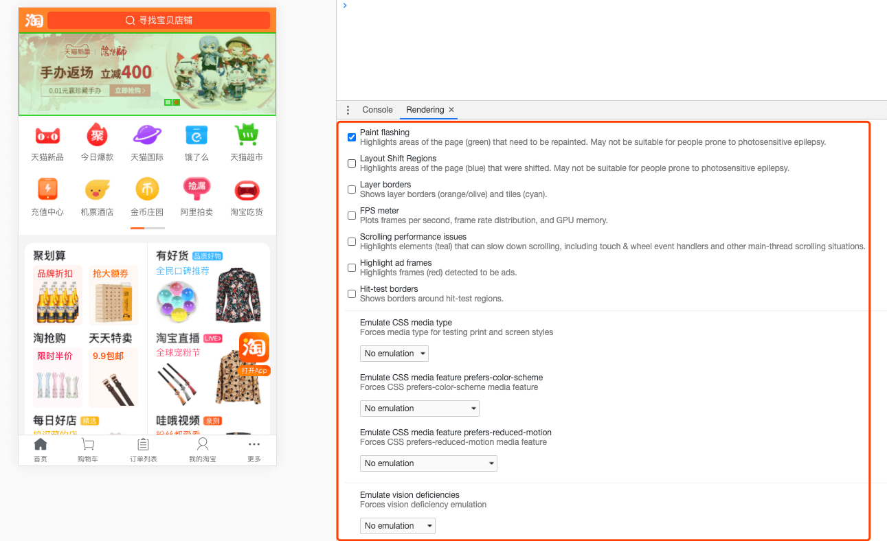

# 性能优化的指标和工具

## 1 性能优化的目的

## 2 性能指标和优化指标

## 3 RAIL 测量模型

## 4 工具之 WebPageTests

## 5 工具之 LightHouse

## 6 performance 工具

Chrome 的开发者工具各有自己的侧重点，如 Network 工具的瀑布图有着资源拉取顺序的详细信息，它的侧重点在于分析网路链路。而 Performance 工具的侧重点则在于前端渲染过程，它拥有帧率条形图、CPU 使用率面积图、资源瀑布图、主线程火焰图、事件总揽等模块，它们和渲染息息相关，善用它们可以清晰地观察整个渲染阶段

performance 工具如下图：

参考下面文章：

[https://juejin.im/post/5b65105f5188251b134e9778](https://juejin.im/post/5b65105f5188251b134e9778)

[https://developers.google.com/web/tools/chrome-devtools/evaluate-performance](https://developers.google.com/web/tools/chrome-devtools/evaluate-performance)

下面搬运一点这篇文章的内容：

跟页面性能挂勾比较深的几个维度是：网络链路、服务器资源、前端渲染效率、客户端硬件

这几个维度不是互不相关的，反而是犬牙交错的关系。例如渲染过程中浏览器反应很慢，有可能是脚本写得太烂遭遇性能瓶颈，也有可能是应用开太多或者正在打游戏占用了过多计算机资源

**控制面板选项：**

- Network 限制网速
- CPU 限制 CPU 资源
- Disable JavaScript samples 使工具忽略记录 JS 的调用栈
- Enable advanced paint instrumentation 详细记录某些渲染事件的细节

**CPU 面积图：**

- 蓝色：加载（Loading）事件
- 黄色：脚本运算（Scripting）事件
- 紫色：渲染（Rendering）事件
- 绿色：绘制（Painting）事件
- 灰色：其他（Other）
- 闲置：浏览器空闲

**Frames：**

帧线程，可以看到每一次渲染的页面，鼠标悬浮绿色块可以看到 fps

**渲染事件：**

- Parse HTML 解析 HTML
- Evaluate Script 执行 JavaScript
- Recalculate style 计算样式
- Layout 计算每个节点在屏幕中的精确位置和大小
- Update Layer Tree
- Paint 绘制到图层
- Composite Layers 渲染引擎合成图层最终人眼可见

## 7 rendering 工具

这个工具可以很直观的观察页面的渲染情况：

- Paint flashing 高亮重绘区域
- Layout Shift Regions 高亮移动的区域
- Layer borders 显示图层组合边界
- FPS meter 显示帧率
- Scrolling performance issues 高亮显示影响滚动的元素
- Highlight ad frames
- Hit-test borders

## 8 性能测量 APIs
