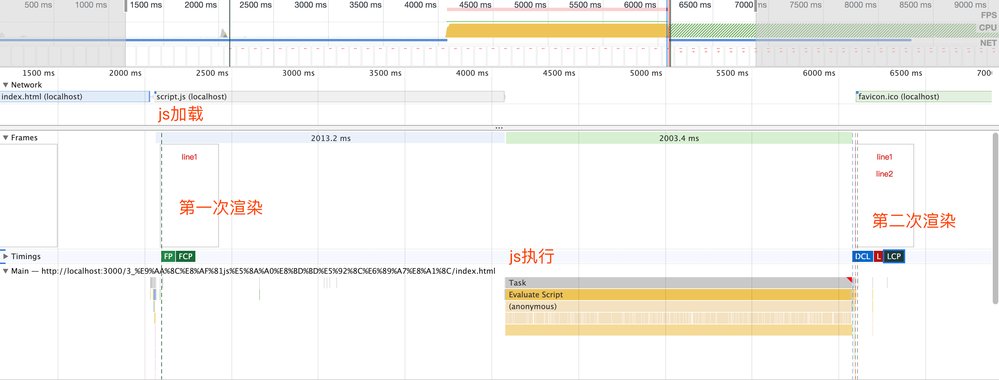

# 渲染优化

## 1 浏览器渲染过程


1. 解析 HTML 生成 DOM 树
2. 解析 CSS 生成 CSSOM 规则树
3. 将 DOM 树与 CSSOM 规则树合并在一起生成渲染树
4. 遍历渲染树开始布局，计算每个节点的位置大小信息
5. 将渲染树每个节点绘制到屏幕

这五个步骤并不一定一次性顺序完成。如果 DOM 或 CSSOM 被修改，以上过程需要重复执行，这样才能计算出哪些像素需要在屏幕上进行重新渲染。实际页面中，CSS 与 JavaScript 往往会多次修改 DOM 和 CSSOM

## 2 重绘和回流

### 2.1 回流

- 当 render tree 中的一部分（或全部）因为元素的规模尺寸、布局、隐藏等改变而需要重新构建。这就称为回流
- 当页面的布局和几何属性改变时，就需要回流

会触发回流的 css 属性：

- 盒子模型相关属性。width, height, padding, margin, display, border, min-height
- 定位属性和浮动。top, bottom, left, right, position, float, clear
- 改变节点内部文字结构。text-aligin, overflow, font-weight, font-family, line-height, vertival-aligin, font-size

### 2.2 重绘

- 当 render tree 中的一些元素需要更新属性，而这些属性只是影响元素的外观，风格，而不会影响布局的，比如 `background-color`。这就称为重绘

**回流一定会引起重绘，而重绘不一定会引起回流**

只触发重绘的 css 属性：

color, border-style, border-radius, visibility, text-decoration, background, background-image, background-position, background-repeat, background-size, outline-color, outline-style, box-shadow

## 3 复合线程与图层

### 3.1 新建 DOM 的过程

1. 获取 DOM 后分割为多个图层
2. 对每个图层的节点计算样式结果（recalculate style - 样式重计算）
3. 为每个节点生成图形和位置（layout - 回流和重布局）
4. 将每个节点绘制填充到图层位图中（paint - 重绘）
5. 图层作为纹理上传到 GPU
6. 合成多个图层到页面上生成最终屏幕图像（composite layers - 图层重组）

> 重绘和回流是以图层为单位的

将频繁重绘回流的 DOM 元素单独作为一个独立图层，那么这个 DOM 元素的重绘和回流的影响只会在这个图层中。

但是图层并不是越多越好，图层的合成运算量是比较大的，如果图层太多的话就会在 composite layers 这里消耗大量的性能，这点也是需要极力避免的。

### 3.2 chrome 创建图层的条件

- 3D 或透视变换 CSS 属性（perspective transfrom）
- 使用加速视频解码的 video 节点 (浏览器会对 video 的每一帧进行重绘，所以能看到连续的视频)
- 拥有 3D (WebGl) 上下文或加速 2D 上下文的 canvas 节点
- 混合插件 (如 flash)
- 对自己的 opacity 做 CSS 动画或使用一个动画 webkit 变换的元素
- 拥有加速 CSS 过滤器的元素 (translate 3d)
- 元素拥有一个 z-index 较低且包含一个复合层的兄弟元素 (即有兄弟元素，有 z-index)

gif 图会持续的触发重绘，但是不会创建新的图层

## 4 避免重绘

- 使用 translate 代替 top，top 会触发 layout 但 translate 不会
- 使用 opacity 代替 visibility，独立图层情况下，visibility 会触发重绘但是 opacity 不会
- 不要一条条修改 DOM 样式，预先定义好 class 然后修改 DOM 的 className，因为每修改一条样式都会触发重绘
- 把 DOM 离线后修改，display: none，后续修改都不会重绘
- 不要把 DOM 的属性值放在循环里，当成循环的变量。比如获取 offsetHeight 时，会触发回流。因为需要刷新缓冲区域，去获取真实的值
- 不要使用 table 布局，可能一个小改动会造成整个 table 的重新布局
- 动画实现速度的选择，UI 线程和 js 线程是相互阻塞的，css 动画会影响 js 运行
- 动画区域使用新图层
- 启动 GPU 硬件加速

## 5 使用 FastDom

todo

在某些场景避免不了频繁的回流和重绘，比如 js 动画，就可能会造成布局抖动

布局抖动是因为有连续的读写 dom 属性的操作，造成了强制回流

**解决方案：**

1. 读写分离 (统一读取属性和修改属性)
2. 使用 FastDom (FastDom 实现了读写分离)

## 6 阻塞渲染

### 6.1 验证 CSS 加载是否阻塞页面渲染

默认情况下，CSS 被视为阻塞渲染的资源，这意味着浏览器将不会渲染任何已处理的内容，直至 CSSOM 构建完毕。

CSSOM 构建时，JavaScript 执行将暂停，直至 CSSOM 就绪。

html 中有如下代码，css 放在两个 div 的中间：

```html
<!DOCTYPE html>
<html lang="zh_CN">
  <head>
    <meta charset="UTF-8" />
    <meta name="viewport" content="width=device-width, initial-scale=1.0" />
    <title>验证css加载是否影响页面渲染</title>
  </head>
  <body>
    <div class="text1">line1</div>
    <link href="./styles.css" rel="stylesheet" />
    <div class="text1">line2</div>
  </body>
</html>
```

运行结果如下：


可以看到页面渲染了两次，第一次是在 html 加载完成，css 还未加载完成的时候，这时页面只渲染出了 line1，并且没有样式

第二次渲染是在 css 加载完成后，这时把 line1 line2 都渲染出来了，并且有样式

**结论：**

- 页面渲染顺序执行
- 页面渲染不会等待 css js 都加载完成 (但是只会渲染一部分)
- css 加载会阻塞页面的渲染 (css 后面的内容需要等待 css 加载完成才会渲染)

### 6.2 验证 js 加载是否影响页面渲染

html 中有如下代码：

```html
<body>
  <div class="text1">line1</div>
  <script src="./script.js"></script>
  <div class="text1">line2</div>
</body>
```

运行结果：



**结论：**

- js 加载会阻塞页面渲染，js 后面的内容在 js 加载完成前不会被渲染
- js 运行会阻塞页面渲染，js 运行时页面不会被渲染，因为 js 可能会操作 dom 或者修改文档结构，不可能一边操作 dom 一边渲染
- js 顺序执行，阻塞后续 js 的执行

### 6.3 defer

```html
<body>
  <div class="text1">line1</div>
  <script src="./script1.js" defer></script>
  <script src="./script2.js" defer></script>
  <div class="text1">line2</div>
</body>
```

运行结果: 先渲染页面，然后执行 js，并且顺序执行


**结论：**

- async 与 defer 属性对于 inline-script 都是无效的
- defer 属性表示延迟执行引入的 JavaScript，即这段 JavaScript 加载时 HTML 并未停止解析，这两个过程是并行的
- defer 不会改变 script 中代码的执行顺序 (加了 defer 属性的 js) (没有加 defer 的 js 会阻塞并且先执行)

### 6.4 async

- async 与 defer 的区别在于，如果已经加载好，就会开始执行
- 多个 async-script 的执行顺序是不确定的
- 向 document 动态添加 script 标签时，async 属性默认是 true

## 7 高频事件防抖

todo

在一些频繁触发的事件中可能会造成布局抖动 (卡顿)，比如 mousemove 事件

或者是实现 js 动画的时候

造成抖动的原因通常是过多的触发了一个操作，比如 js 动画中触发的帧数过多 (100 帧)，而实际不需要这么多帧数 (60 帧)

**解决方案：**

- 使用 `requestAnimationFrame` 将帧数控制在合理范围

## 8 React 时间调度实现
