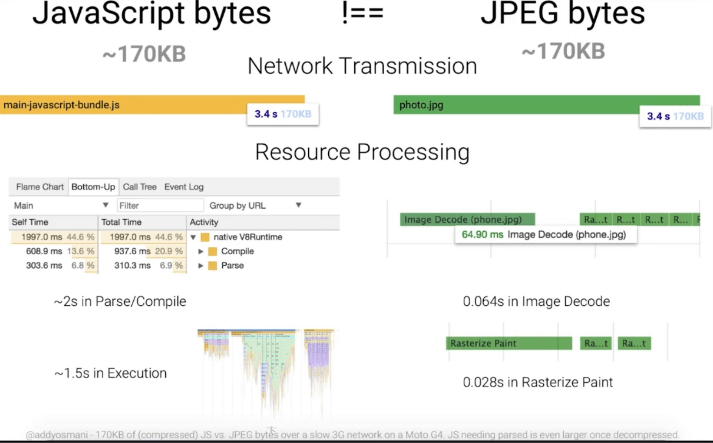

# 代码优化

## 1 JS 缩短解析时间

加载一个 js 资源要比加载一个图片资源耗时长的多，js 加载后还需要耗时解析和执行



我们要做的优化就是缩小 js 的大小，加快解析和执行的时间

**解决方案：**

- 压缩 js
- 代码拆分，按需加载
- Tree shaking 清除没用到的代码

## 2 配合 V8 有效优化代码

## 3 函数优化

**函数有两种解析方式：**

1. 懒解析 (lazy parsing)：默认的解析方式。函数声明的时候不解析，而是在使用的时候解析。这就不需要提前为函数创建语法树，能加快解析速度节约资源
2. 饥饿解析 (eager parsing)：快速解析

一般的函数默认懒解析就可以，需要立即执行的函数在声明时建议进行饥饿解析

将函数用小括号包裹会进行饥饿解析：

```js
(function add(a, b) {
  return a + b;
});
```

## 4 对象优化

**对象可以做的优化：**

1. 以相同的顺序初始化对象成员，避免隐藏类的调整
2. 实例化后避免添加新属性
3. 尽量使用 Array 代替 Array like 对象

浏览器引擎对 js 运行做了很多优化，这里的优化只要是迎合引擎的优化，即迎合引擎的优化规则

## 5 HTML 优化

- 减少 iframes 的使用，会阻碍父文档的加载。要用的话尽量延时加载，让父文档先加载完
- 压缩代码
- 避免节点深层级嵌套 (渲染更慢)
- 避免 table 布局 (渲染更慢)

## 6 CSS 优化

- 降低 CSS 对渲染的阻塞
- 利用 GPU 完成动画
- 使用 contain 属性 (表示当前元素不影响外部的元素，浏览器渲染时只对这个元素做更新)
- 使用 font-display 属性
