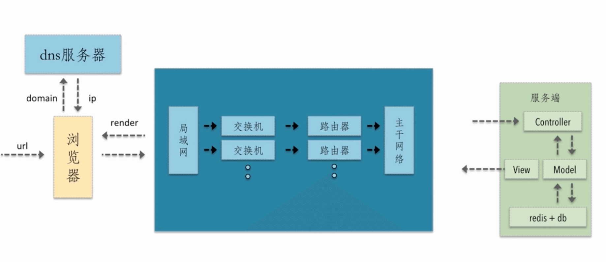

# 资源优化

## 1 资源压缩与合并

### 1.1 优化思路

web 前端是 BS 架构。

BS 架构就是，前端代码开发完成后，将代码发布到远程服务器。然后用户通过浏览器输入网址，这时浏览器向远程服务器发出请求，动态的加载页面的资源。

因此 web 前端的访问过程是一个动态、增量的加载资源的过程。如果浏览器能越快的获取资源，那么用户就能越快的看到页面，体验也就越好。这是前端性能优化很重要的一个点。

从资源加载方面优化，需要先分析一下，浏览器的一个请求从发送到返回都经历了什么？

上图是一个 http 请求发出到响应的过程，在这个过程中可以去挖掘一些可以优化的点，去实现前端的性能优化。

请求过程中一些潜在的性能优化点：

- dns 是否可以通过缓存减少 dns 查询时间
- 网络请求的过程中是否可以走最近的网络环境
- 相同的静态资源是否可以缓存
- 能否减少 http 请求大小
- 减少 http 请求
- 服务端渲染

### 1.2 优化点

资源合并与压缩涉及到的优化点主要有两个，一个是减少 http 请求数量，另外是减少请求资源的大小

具体的优化点如下：

- html 压缩
- css 压缩
- js 的压缩和混乱
- 文件合并
- 开启 gzip

### 1.3 html 压缩

html 代码压缩就是压缩这些在文本文件中有意义，但是在 html 中不显示的字符，包括空格、制表符、换行符等，还有一些其他无意义的字符，如 html 注释也可以被压缩

### 1.4 css 压缩

- 无效代码删除（空格、换行、注释等）
- css 语义合并（重复的代码）

### 1.5 js 压缩与混乱

- 无效字符的删除
- 删除注释
- 代码语义的缩减和优化（缩短变量名的长度，删除重复代码等）
- 代码保护（js 的代码是透明的，压缩和混淆后可以降低代码的可读性）

js 和 css 代码压缩不仅能减少文件大小，还有有网站安全方面的收益。并且 js 和 css 的压缩率是比较高的，可以很大程度的减少文件的大小

### 1.6 文件合并

合并文件可以减少 http 请求的数量。

请求多个 js 文件跟请求一个 js 文件相比：

- 文件与文件之间有插入的上行请求，增加了 N-1 个网络延迟
- 受丢包的影响更严重（请求数量更多，丢包的概率更大）

当然合并文件也不是万能的，合并文件也有它的缺点：

- 首屏渲染问题
- 缓存失效问题

文件合并后自然单个文件会变得更大。如果网站是单页面应用，合并文件通常会把公共库还有其他页面的 js 都打包在一起，而首屏渲染需要等待这些资源都加载完成。其中很多资源是首屏页面不需要的。

缓存失效问题，合并文件会造成大面积的缓存失效。通常当一个文件有改动时才需要重新加载。如果将几个文件合并的话，其中一个文件有改动，那么合并后的文件也会改动，这时就需要重新加载整个文件。而未合并的话只需要重新加载改动的文件就行。

**常用的文件合并策略：**

- 公共库合并（通常公共库会很少改动，将它们合并更不容易出现缓存失效问题）
- 分页面合并（也就是按需加载，不要将所有页面都打包到一起，而是将单个页面所依赖的资源打包，匹配到某个路由的时候只加载这个路由需要的资源）

## 2 图片格式优化

### 2.1 jpeg

JPEG(联合图像专家组 Joint Photographic Experts Group) 。JPEG 编码用来压缩去除冗余的图像和彩色数据，获取得极高的压缩率的同时能展现十分丰富生动的图像。具有调节图像质量的功能，允许你用不同的压缩比例对这种文件压缩。不支持透明度。

### 2.2 png

PNG(便携式网络图形 Portable Network Graphics)。是一种无损压缩的位图图形格式。

- png8 - 256 色，支持透明
- png24 - 2^24 色，不支持透明
- png24 - 2^24 色，不支持透明

PNG 格式适合保存文本，线条或类似的边缘清晰，有大块相同颜色区域的图像。

JPEG 采用了一种针对照片图像的特定有损编码方法，这种编码适用于低对比，图像颜色过渡平滑，噪声多，且结构不规则的图像。

### 2.3 不同图片格式常用的业务场景

- jpeg 为有损压缩，压缩率高，不支持透明
- png 为无损压缩，支持透明
- webp 压缩程度更好，在 ios webview 有兼容性问题（安卓上用）
- svg 矢量图，代码内嵌，相对较小。适用图片样式现对简单的场景
- gif 一般用来做动图

## 3 图片加载优化

1. 转成合适的格式，或对图片进行压缩，针对图片的真实情况，舍弃一些相对无关紧要的色彩信息
2. 使用 css 雪碧图，将一些图片整合到一张图片中，减少 http 的请求数量（缺点：整合图片比较大时，一次加载比较慢）
3. inline image，将图片内嵌在代码中（即转成 base64），通常针对较小的图片
4. 使用 svg 进行图片的绘制，将图标转成字体。如 [https://www.iconfont.cn/](https://www.iconfont.cn/)

## 4 字体优化
