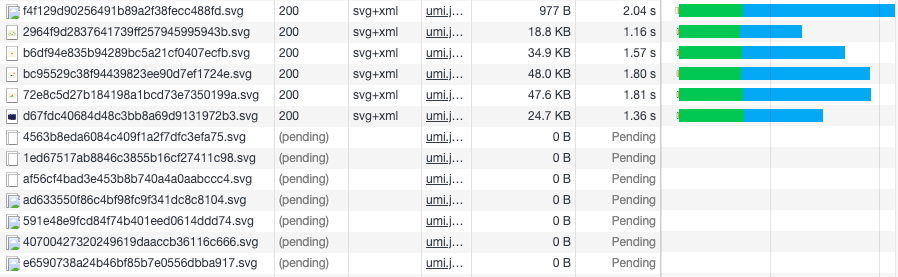
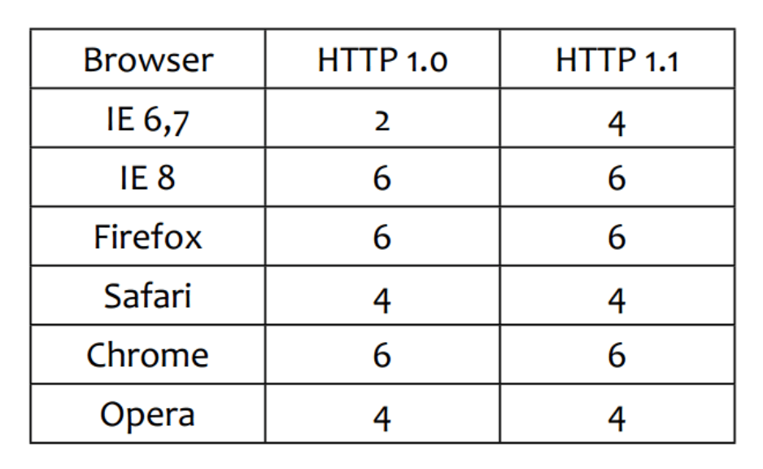
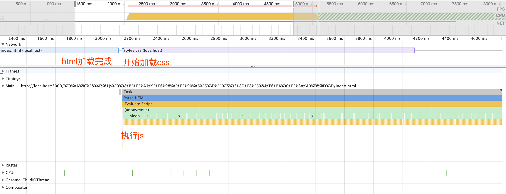

# 传输优化

## 1 懒加载

懒加载也叫延迟加载，指的是在长网页中延迟加载图像，是一种很好优化网页性能的方式。用户滚动到它们之前，可视区域外的图像不会加载。这与图像预加载相反，在长网页上使用延迟加载将使网页加载更快。在某些情况下，它还可以帮助减少服务器负载。常适用图片很多，页面很长的电商网站场景中。

### 1.1 为什么要使用懒加载

- 能提升用户的体验，例如用户打开像手机淘宝长页面的时候，如果页面上所有的图片都需要加载，由于图片数目较大，等待时间就会很长，这就严重影响用户体验
- 减少无效资源的加载，这样能明显减少了服务器的压力和流量，也能够减小浏览器的负担
- 防止并发加载的资源过多会阻塞 js 的加载，影响网站的正常使用

### 1.2 实现原理

首先将页面上的图片的 src 属性设为空字符串，而图片的真实路径则设置在 data-src 属性中。

当页面滚动的时候需要去监听 scroll 事件，在 scroll 事件的回调中，判断我们的懒加载的图片是否进入可视区域,如果图片在可视区内将图片的 src 属性设置为 data-src 的值，这样就可以实现延迟加载

## 2 预加载

资源预加载是另一个性能优化技术，我们可以使用该技术来预先告知浏览器某些资源可能在将来会被使用到。

预加载简单来说就是将所有所需的资源提前请求加载到本地，这样后面在需要用到时就直接从缓存取资源

### 2.1 为什么要使用预加载

在网页全部加载之前，对一些主要内容进行加载，以提供给用户更好的体验。

通常适用于交互比较多的页面或者游戏。比如页面一部分需要用户的交互才会出现，如果没有用预加载的话，后续出现的内容或者交互的音效就会因为没有加载完成而不会及时的出现，那么体验就会很差。

### 2.2 实现方法

- html 标签
- image 对象
- ajax，可以更精细的控制加载过程
- preloadJS 库

## 3 资源加载

浏览器是并行加载资源的，但是并发受域名限制，也就是一个域名只能并发加载一定数量的资源。

当 HTML 解析器被脚本阻塞时，解析器虽然会停止构建 DOM，但仍然会识别该脚本后面的资源，并进行预加载。

### 2.1 验证并发加载

如下图，同域名只会同时加载 6 个资源



每个浏览器的并发数可能会不一样（这个图搬运来的，实际情况可能不一致，随着浏览器更新默认值也可能变动），并发数可以设置更改



**结论：**

- 资源会并发加载
- 并发加载有数量限制 (并不是越多越好)
- 各浏览器的限制不一样

### 2.2 验证 js 阻塞是否影响资源加载

html 代码如下：

```html
<!DOCTYPE html>
<html lang="zh_CN">
  <head>
    <meta charset="UTF-8" />
    <meta name="viewport" content="width=device-width, initial-scale=1.0" />
    <title>test</title>

    <script>
      function sleep(time) {
        let endTime = new Date().getTime() + time * 1000;

        while (new Date().getTime() < endTime) {}
      }

      sleep(3);
    </script>
  </head>
  <body>
    <div class="text1">line1</div>
    <link href="./styles.css" rel="stylesheet" />
  </body>
</html>
```

在 header 中有一段 js 代码，会阻塞 3 秒钟。



**结论：**

- js 阻塞不会影响其他资源的加载

## 4 启用 gzip

## 5 启用 Keep Alive

## 6 server workers

## 7 http2

## 8 SSR 服务端渲染

## 9 浏览器缓存

见下一节
