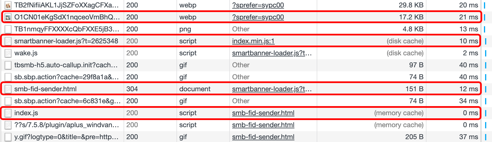
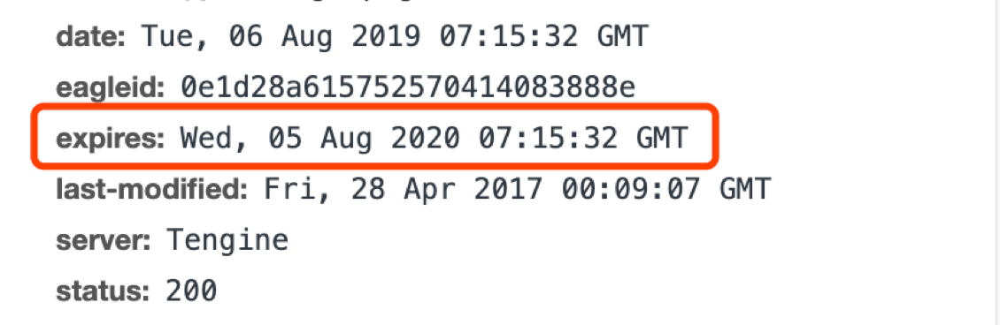
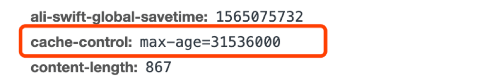
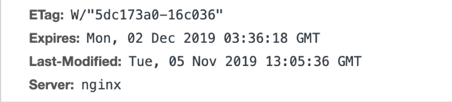
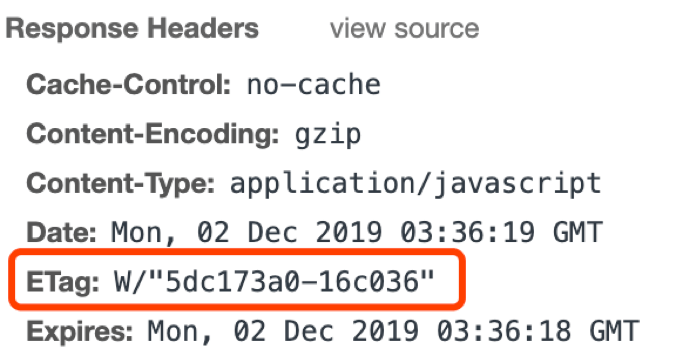
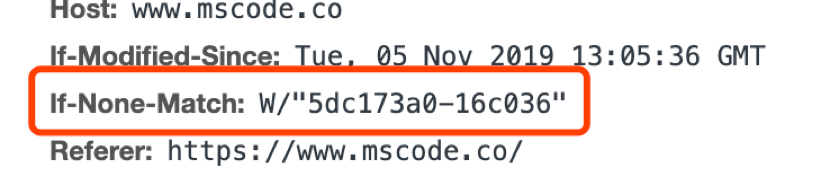

# 浏览器缓存(http 缓存)

浏览器缓存其实就是浏览器保存通过 HTTP 获取的所有资源,是浏览器将网络资源存储在本地的一种行为。



## 1 缓存存储的位置

- memory cache 将资源缓存到内存中，等待下次访问时不需要重新下载资源，而直接从内存中获取
- disk cache 将资源缓存到磁盘中，等待下次访问时不需要重新下载资源，而直接从磁盘中获取

| -        | memory cache                       | disk cache                          |
| -------- | ---------------------------------- | ----------------------------------- |
| 相同点   | 只能存储一些派生类资源文件         | 只能存储一些派生类资源文件          |
| 不同点   | 退出进程时数据会被清除             | 退出进程时数据不会被清除            |
| 存储资源 | 一般脚本、字体、图片会存在内存当中 | 一般非脚本会存在内存当中，如 css 等 |

> 因为 CSS 文件加载一次就可渲染出来,我们不会频繁读取它,所以它不适合缓存到内存中,但是 js 之类的脚本却随时可能会执行,如果脚本在磁盘当中,我们在执行脚本的时候需要从磁盘取到内存中来,这样 IO 开销就很大了,有可能导致浏览器失去响应。

**三级缓存原理 (访问缓存优先级)**

- 先在内存中查找,如果有,直接加载
- 如果内存中不存在,则在硬盘中查找,如果有直接加载
- 如果硬盘中也没有,那么就进行网络请求
- 请求获取的资源缓存到硬盘和内存

## 2 缓存类型

强缓存：

- Expires，是  http1.0  时的规范，它的值为一个绝对时间的 GMT 格式的时间字符串，表示资源的失效时间
- Cache-Control， http1.1  时出现的 header 信息，主要是利用该字段的  max-age  值来进行判断，它是一个相对时间

协商缓存：

- Last-Modify/If-Modify-Since，是一个时间标识该资源的最后修改时间，当浏览器再次请求该资源时，request 的请求头中会包含 If-Modify-Since，该值为缓存之前返回的 Last-Modify
- ETag/If-None-Match，返回的是一个校验码，资源变化都会导致 ETag 变化，服务器根据 If-None-Match 值来判断是否命中缓存

## 3 强缓存

浏览器在加载资源时，会先根据本地缓存资源的 header 中的信息判断是否命中强缓存，如果命中则直接使用缓存中的资源不会再向服务器发送请求

### 3.1 Expires

该字段是 http1.0 时的规范，它的值为一个绝对时间的 GMT 格式的时间字符串，这个时间代表着这个资源的失效时间，在此时间之前，即命中缓存



缺点：

> 由于失效时间是一个绝对时间，所以当服务器与客户端时间偏差较大时，就会导致缓存混乱

### 3.2 Cache-Control

Cache-Control 是 http1.1 时出现的 header 信息，主要是利用该字段的 max-age 值来进行判断，它是一个相对时间，例如 Cache-Control:max-age=3600，代表着资源的有效期是 3600 秒



**常用值：**

- no-cache：需要进行协商缓存，发送请求到服务器确认是否使用缓存
- no-store：禁止使用缓存，每一次都要重新请求数据
- public：可以被所有的用户缓存，包括终端用户和 CDN 等中间代理服务器
- private：只能被终端用户的浏览器缓存，不允许 CDN 等中继缓存服务器对其缓存
- Cache-Control 与 Expires 可以在服务端配置同时启用，同时启用的时候 Cache-Control 优先级高

## 4 协商缓存

当强缓存没有命中的时候，浏览器会发送一个请求到服务器，服务器根据 header 中的部分信息来判断是否命中缓存。如果命中，则返回 304 ，告诉浏览器资源未更新，可使用本地的缓存

### 4.1 Last-Modify/If-Modify-Since

浏览器第一次请求一个资源的时候，服务器返回的 header 中会加上 Last-Modify，Last-modify 是一个时间标识该资源的最后修改时间

当浏览器再次请求该资源时，request 的请求头中会包含 If-Modify-Since，该值为缓存之前返回的 Last-Modify。服务器收到 If-Modify-Since 后，根据资源的最后修改时间判断是否命中缓存

如果命中缓存，则返回 304，并且不会返回资源内容，并且不会返回 Last-Modify


(response header)

(request header)

**缺点：**

- 短时间内资源发生了改变，Last-Modified 并不会发生变化
- 如果这个资源在一个周期内修改回原来的样子了，我们认为是可以使用缓存的，但是 Last-Modified 会改变

参考文档：

[https://juejin.im/post/5c4528a6f265da611a4822cc#heading-12](https://juejin.im/post/5c4528a6f265da611a4822cc#heading-12)

### 4.2 ETag/If-None-Match

Etag/If-None-Match 返回的是一个校验码。ETag 可以保证每一个资源是唯一的，资源变化都会导致 ETag 变化。服务器根据 If-None-Match 值来判断是否命中缓存。

Last-Modified 与 ETag 是可以一起使用的，服务器会优先验证 ETag，一致的情况下，才会继续比对 Last-Modified，最后才决定是否返回 304


(response header)

(request header)

## 5 注意点

- 强缓存和协商缓存都需要服务端返回相应的 response header
- 协商缓存需要服务端去对比 requese header 中的 If-Modify-Since/If-None-Match，然后返回资源或 304

如 express 使用的 `server-static` 中间件的配置：

```javascript
app.use(
  serverStatic('static', {
    etag: true,
    lastModified: true,
    maxAge: 0
  })
);
```
