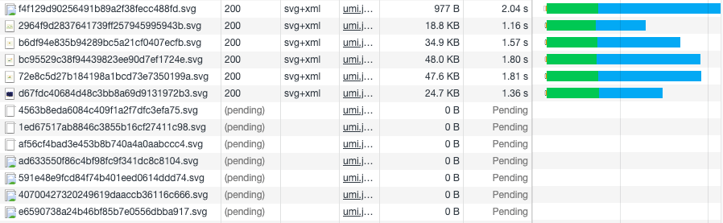
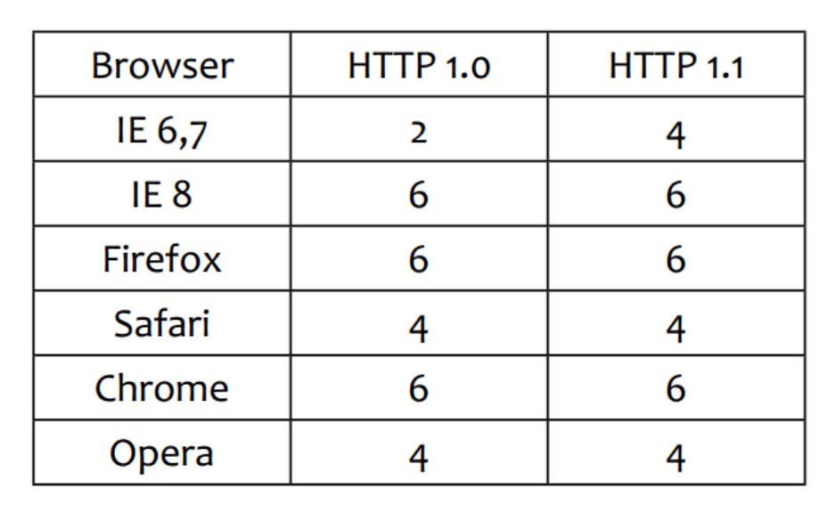
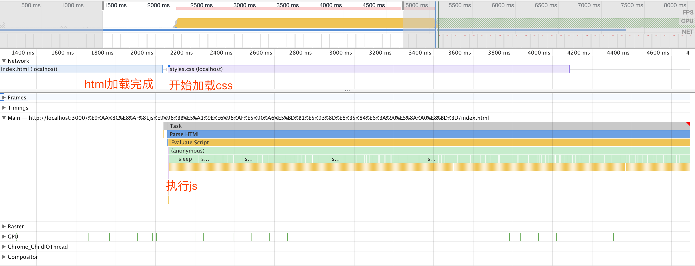
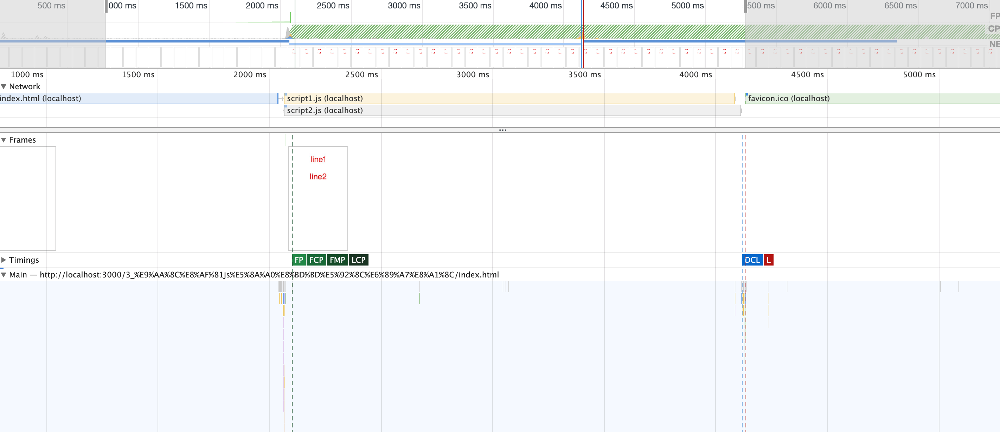

# css 和 js 的装载与执行

## 1 html 页面加载渲染的过程


1. 解析 HTML 生成 DOM 树
2. 解析 CSS 生成 CSSOM 规则树
3. 将 DOM 树与 CSSOM 规则树合并在一起生成渲染树
4. 遍历渲染树开始布局，计算每个节点的位置大小信息
5. 将渲染树每个节点绘制到屏幕

这五个步骤并不一定一次性顺序完成。如果 DOM 或 CSSOM 被修改，以上过程需要重复执行，这样才能计算出哪些像素需要在屏幕上进行重新渲染。实际页面中，CSS 与 JavaScript 往往会多次修改 DOM 和 CSSOM

## 2 资源加载

浏览器是并行加载资源的，但是并发受域名限制，也就是一个域名只能并发加载一定数量的资源。

当 HTML 解析器被脚本阻塞时，解析器虽然会停止构建 DOM，但仍然会识别该脚本后面的资源，并进行预加载。

### 2.1 验证并发加载

如下图，同域名只会同时加载 6 个资源



每个浏览器的并发数可能会不一样（这个图搬运来的，实际情况可能不一致，随着浏览器更新默认值也可能变动），并发数可以设置更改



**结论：**

- 资源会并发加载
- 并发加载有数量限制 (并不是越多越好)
- 各浏览器的限制不一样

### 2.2 验证 js 阻塞是否影响资源加载

html 代码如下：

```html
<!DOCTYPE html>
<html lang="zh_CN">
  <head>
    <meta charset="UTF-8" />
    <meta name="viewport" content="width=device-width, initial-scale=1.0" />
    <title>test</title>

    <script>
      function sleep(time) {
        let endTime = new Date().getTime() + time * 1000;

        while (new Date().getTime() < endTime) {}
      }

      sleep(3);
    </script>
  </head>
  <body>
    <div class="text1">line1</div>
    <link href="./styles.css" rel="stylesheet" />
  </body>
</html>
```

在 header 中有一段 js 代码，会阻塞 3 秒钟。



**结论：**

- js 阻塞不会影响其他资源的加载

## 3 阻塞渲染

### 3.1 验证 CSS 加载是否阻塞页面渲染

默认情况下，CSS 被视为阻塞渲染的资源，这意味着浏览器将不会渲染任何已处理的内容，直至 CSSOM 构建完毕。

CSSOM 构建时，JavaScript 执行将暂停，直至 CSSOM 就绪。

html 中有如下代码，css 放在两个 div 的中间：

```html
<!DOCTYPE html>
<html lang="zh_CN">
  <head>
    <meta charset="UTF-8" />
    <meta name="viewport" content="width=device-width, initial-scale=1.0" />
    <title>验证css加载是否影响页面渲染</title>
  </head>
  <body>
    <div class="text1">line1</div>
    <link href="./styles.css" rel="stylesheet" />
    <div class="text1">line2</div>
  </body>
</html>
```

运行结果如下：


可以看到页面渲染了两次，第一次是在 html 加载完成，css 还未加载完成的时候，这时页面只渲染出了 line1，并且没有样式

第二次渲染是在 css 加载完成后，这时把 line1 line2 都渲染出来了，并且有样式

**结论：**

- 页面渲染顺序执行
- 页面渲染不会等待 css js 都加载完成 (但是只会渲染一部分)
- css 加载会阻塞页面的渲染 (css 后面的内容需要等待 css 加载完成才会渲染)

### 3.2 验证 js 加载是否影响页面渲染

html 中有如下代码：

```html
<body>
  <div class="text1">line1</div>
  <script src="./script.js"></script>
  <div class="text1">line2</div>
</body>
```

运行结果：


**结论：**

- js 加载会阻塞页面渲染，js 后面的内容在 js 加载完成前不会被渲染
- js 运行会阻塞页面渲染，js 运行时页面不会被渲染，因为 js 可能会操作 dom 或者修改文档结构，不可能一边操作 dom 一边渲染
- js 顺序执行，阻塞后续 js 的执行

### 3.3 defer

```html
<body>
  <div class="text1">line1</div>
  <script src="./script1.js" defer></script>
  <script src="./script2.js" defer></script>
  <div class="text1">line2</div>
</body>
```

运行结果: 先渲染页面，然后执行 js，并且顺序执行



**结论：**

- async 与 defer 属性对于 inline-script 都是无效的
- defer 属性表示延迟执行引入的 JavaScript，即这段 JavaScript 加载时 HTML 并未停止解析，这两个过程是并行的
- defer 不会改变 script 中代码的执行顺序 (加了 defer 属性的 js) (没有加 defer 的 js 会阻塞并且先执行)

### 3.4 async

- async 与 defer 的区别在于，如果已经加载好，就会开始执行
- 多个 async-script 的执行顺序是不确定的
- 向 document 动态添加 script 标签时，async 属性默认是 true
