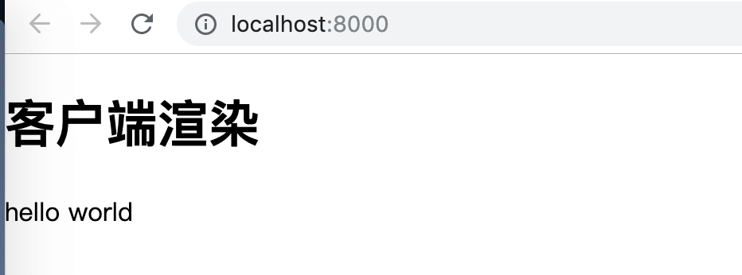
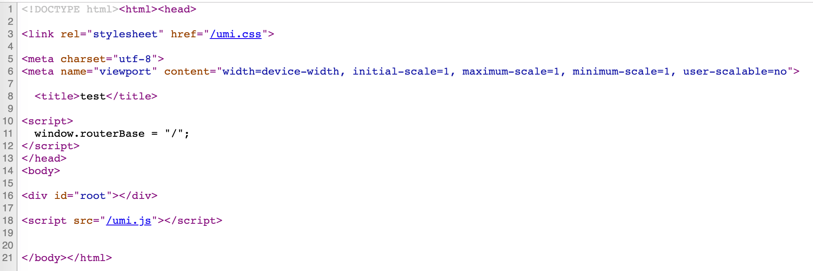
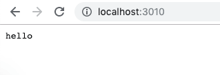
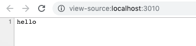
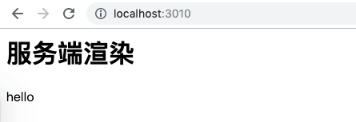
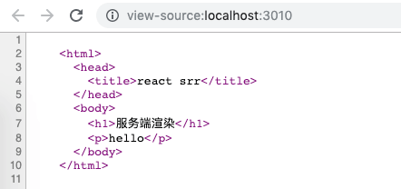

# SSR 与 CSR 实例

下面通过实例更直观的理解服务端渲染与客户端渲染。

## 1 客户端渲染

通过 `create-react-app` 创建一个 react 项目（或者其他工具，这里用的是 umi），直接在开发环境启动，下面是项目的首页：

```javascript
class Index extends React.Component {
  render() {
    return (
      <div>
        <h1>客户端渲染</h1>
        <p>hello world</p>
      </div>
    );
  }
}
```

在浏览器中查看，页面已经展示出了内容：



再在浏览器中查看源代码，发现在里面并没有组件中的内容：



这就是客户端渲染，浏览器最开始拿到的只是一个 html 的框架，页面的内容是通过 js 生成，而 js 是运行在浏览器上的，所以是客户端渲染。像爬虫爬到的也就是上图所看到的内容，不管页面里面有什么内容，爬虫都是拿不到的，所以客户端渲染不利于 SEO。

## 2 服务端渲染

服务端渲染我们得先有个服务器，这里使用 koa 创建一个（或者用 express），如果没接触过可以跟着[文档](https://koajs.com/)创建一个，比较简单。

### 2.1 测试

先来做个测试，给首页配个路由，返回一个字符串：

```javascript
router.get('/', (ctx, next) => {
  ctx.body = 'hello';
});
```

浏览器中的效果，展示的是返回的内容：



在浏览器中查看源代码，可以看到浏览器拿到的就是服务端返回的内容：



### 2.2 返回 html

我们将返回的内容换成一串 html 字符串。

```javascript
router.get('/', (ctx, next) => {
  ctx.body = `
    <html>
      <head>
        <title>react srr</title>
      </head>
      <body>
        <h1>服务端渲染</h1>
        <p>hello</p>
      </body>
    </html>
  `;
});
```

浏览器中的效果：



查看源代码：



这里就实现了一个最简单的服务端渲染，可以看到服务端渲染就是浏览器能直接拿到页面的内容。
