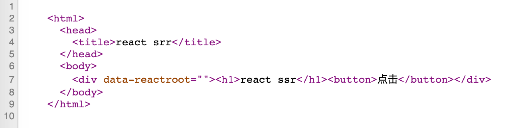
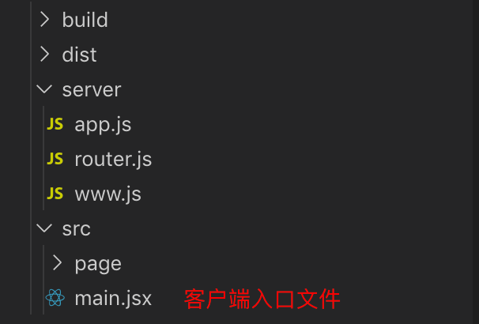

# 同构

demo 地址 [https://github.com/wawjqyh/demo-react-ssr/tree/master/3-isomorphism](https://github.com/wawjqyh/demo-react-ssr/tree/master/3-isomorphism)

## 1 同构的概念

同构的意思就是一套 react 代码，在服务端执行一次，再到客户端端执行一次。

为什么要做同构呢，先来看一个例子：

```javascript
class Index extends Component {
  render() {
    return (
      <div>
        <h1>同构</h1>
        <button
          onClick={() => {
            alert('我被点击了');
          }}
        >
          点击
        </button>
      </div>
    );
  }
}
```

上面的组件中有一个按钮，并且绑定了事件，如果使用服务端渲染点击事件不会被触发，因为 `renderToString` 只是将虚拟 dom 转成字符串返回，所以点击事件根本没有绑定。所以这里就需要使用同构，需要将 react 代码再到浏览器执行一次。

使用查看源码查看服务器返回的内容（可以看到并没有绑定事件）：



## 2 如何实现同构

实现同构也就是既要服务器渲染也要客户端渲染，服务端渲染已经实现了，客户端渲染就跟传统的 react 项目一样，在 html 中引入打包后的 js 文件。

不同的是渲染要的方法不一样，同构使用的是 `hydrate` 方法。`render` 方法会再次渲染页面，因为服务端渲染已经拿到了页面的内容，不需要再完整的渲染一次，只需要做一些事件的绑定。

下面摘抄自 react 官网：

```javascript
ReactDOM.hydrate(element, container[, callback])
```

> 与 render() 相同，但它用于在 ReactDOMServer 渲染的容器中对 HTML 的内容进行 hydrate 操作。React 会尝试在已有标记上绑定事件监听器。

注意点：

- 客户端和服务端的代码都需要使用 webpack 打包
- 客户端和服务端使用的是同一套代码（都是调用的 client/pages 下的组件），唯一不同的是 rander 方法不一样
- 需要在 html 中引入打包后的 js 文件

下面是项目的结构（注意这是一个最简单的演示项目，实际项目自行完善）：



```javascript
// src/main.jsx 代码

const appTarget = document.getElementById('root');
// 同构需要使用 hydrate
ReactDOM.hydrate(<Index />, appTarget);
```

```javascript
// server/router.js 代码
router.get('/', (ctx, next) => {
  const content = renderToString(<Home />);

  ctx.body = `
    <html>
      <head>
        <title>react srr</title>
      </head>
      <body>
        <div id="root">${content}</div>
        <script src="/client.js"></script>
      </body>
    </html>
  `;
});

// <div id="root"></div> 中间不要有空格或者换行，不然会有警告
// 在 body 中引入打包后的客户端 js
```
