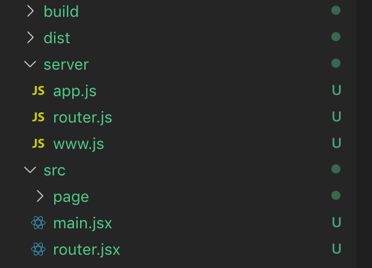

# 在 SSR 中使用路由

demo 地址 [https://github.com/wawjqyh/demo-react-ssr/tree/master/4-router](https://github.com/wawjqyh/demo-react-ssr/tree/master/4-router)

首先看本次用例的项目结构：



下面是一个配置路由的组件，客户端和服务端都是调用这个组件：

```javascript
// src/router.jsx
// 路由配置文件
class RouterIndex extends Component {
  render() {
    return (
      <React.Fragment>
        <Route exact path="/" component={Index} />
        <Route exact path="/login" component={Login} />
        <Route exact path="/hello" component={Hello} />
      </React.Fragment>
    );
  }
}
```

客户端和服务端使用路由的方式区别不大，客户端渲染使用的是 `BrowserRouter`。

如下面的代码：

```javascript
// src/main.jsx
// 客户端使用路由
const appTarget = document.getElementById('root');
ReactDOM.hydrate(
  <BrowserRouter>
    <RouterIndex />
  </BrowserRouter>,
  appTarget
);
```

而服务端渲染使用的是 `StaticRouter`，代码如下：

```javascript
// server/router.js
// 服务端使用路由
router.get('*', (ctx, next) => {
  const content = renderToString(
    <StaticRouter location={ctx.request.url} context={{}}>
      <RouterIndex />
    </StaticRouter>
  );

  ctx.body = `
    <html>
      <head>
        <title>react srr</title>
      </head>
      <body>
        <div id="root">${content}</div>
        <script src="/client.js"></script>
      </body>
    </html>
  `;
});
```

注意点：

- `router.get('*')` 服务端需要匹配所有的路由
- `StaticRouter` 需要传入服务端所匹配到的地址。`BrowserRouter` 可以直接拿到当前地址，因为运行在浏览器端

> 因为使用了同构，服务端渲染只渲染第一次请求的页面

> 页面在浏览器运行后，后面的路由跳转和页面渲染就会由客户端接管，因为单页面应用路由跳转会被拦截。
