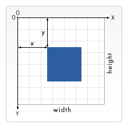

# 坐标定位

## 1 网格

对于所有元素，SVG 使用的坐标系统或者说网格系统，和 Canvas 用的差不多（所有计算机绘图都差不多）

这种坐标系统是：以页面的左上角为 `(0,0)` 坐标点，坐标以像素为单位，x 轴正方向是向右，y 轴正方向是向下



```xml
<rect x="0" y="0" width="100" height="100" />
```

定义一个矩形，即从左上角开始，向右延展 `100px`，向下延展 `100px`，形成一个 `100*100` 大的矩形。

## 2 什么是像素

基本上，在 SVG 文档中的 1 个像素对应输出设备（比如显示屏）上的 1 个像素

但是这种情况是可以改变的，否则 SVG 的名字里也不至于会有“Scalable”（可缩放）这个词。如同 CSS 可以定义字体的绝对大小和相对大小，SVG 也可以定义绝对大小（比如使用“pt”或“cm”标识维度）同时 SVG 也能使用相对大小，只需给出数字，不标明单位，输出时就会采用用户的单位

在没有进一步规范说明的情况下，1 个用户单位等同于 1 个屏幕单位

要明确改变这种设定，SVG 里有多种方法。我们从 svg 根元素开始：

```xml
<svg width="100" height="100">…</svg>
```

上面的元素定义了一个 `100*100px` 的 SVG 画布，这里 1 用户单位等同于 1 屏幕单位

```xml
<svg width="200" height="200" viewBox="0 0 100 100">…</svg>
```

这里定义的画布尺寸是 `200*200px`。但是，viewBox 属性定义了画布上可以显示的区域：从 `(0,0)` 点开始，100 宽*100 高的区域。这个 `100*100` 的区域，会放到 `200*200` 的画布上显示。于是就形成了放大两倍的效果

用户单位和屏幕单位的映射关系被称为用户坐标系统。除了缩放之外，坐标系统还可以旋转、倾斜、翻转。默认的用户坐标系统 1 用户像素等于设备上的 1 像素（但是设备上可能会自己定义 1 像素到底是多大）。在定义了具体尺寸单位的 SVG 中，比如单位是 `cm` 或 `in`，最终图形会以实际大小的 1 比 1 比例呈现
