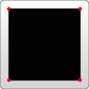
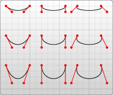
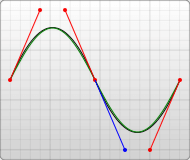
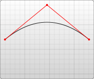
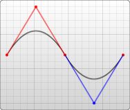
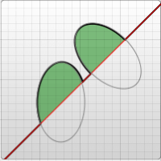
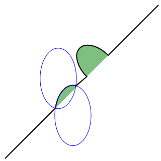
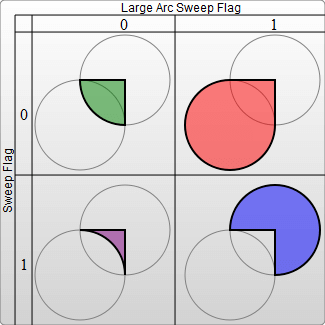

# 路径

## 1 简介

`<path>` 元素是 SVG 基本形状中最强大的一个。你可以用它创建线条，曲线，弧形等等

path 只需要设定很少的点，就可以创建平滑流畅的线条（比如曲线）

path 元素的形状是通过属性 `d` 定义的，属性 `d` 的值是一个 “命令 + 参数” 的序列

每一个命令都用一个关键字母来表示，比如，字母 `M` 表示的是 “Move to” 命令，当解析器读到这个命令时，它就知道你是打算移动到某个点。跟在命令字母后面的，是你需要移动到的那个点的 x 和 y 轴坐标。比如移动到 (10,10) 这个点的命令，应该写成 `M 10 10`。这一段字符结束后，解析器就会去读下一段命令

> 每一个命令都有两种表示方式，一种是用大写字母，表示采用绝对定位。另一种是用小写字母，表示采用相对定位（例如：从上一个点开始，向上移动 10px，向左移动 7px）

因为属性 `d` 采用的是用户坐标系统，所以不需标明单位

## 2 直线命令

### 2.1 移动画笔 M

“Move to” 移动画笔命令 `M`。假设，你的画笔当前位于一个点，在使用 `M` 命令移动画笔后，只会移动画笔，但不会在两点之间画线。因为 `M` 命令仅仅是移动画笔，但不画线

所以 `M` 命令经常出现在路径的开始处，用来指明从何处开始画

```
M x y
(or)
m dx dy
```

```xml
<svg width="200" height="200" xmlns="http://www.w3.org/2000/svg">
  <path d="M10 10"/>
</svg>
```


### 2.2 画线段 L

“Line to” 命令，`L` 需要两个参数，分别是一个点的 x 轴和 y 轴坐标，`L` 命令将会在当前位置和新位置（L 前面画笔所在的点）之间画一条线段。

```
L x y
(or)
l dx dy
```

另外还有两个简写命令，用来绘制水平线和垂直线。`H` 绘制水平线。`V` 绘制垂直线。这两个命令都只带一个参数，标明在 x 轴或 y 轴移动到的位置，因为它们都只在坐标轴的一个方向上移动

```
H x
(or)
h dx

V y
(or)
v dy
```

下面画一个矩形：

```xml
<svg width="100" height="100" xmlns="http://www.w3.org/2000/svg">
  <path d="M 10 10 H 90 V 90 H 10 L 10 10"/>
</svg>
```



### 2.3 闭合路径 Z

`Z` 命令会从当前点画一条直线到路径的起点，尽管我们不总是需要闭合路径，但是它还是经常被放到路径的最后。*另外，Z 命令不用区分大小写*

上面例子里用到的路径，可以简化成这样：

```xml
<path d="M 10 10 H 90 V 90 H 10 Z" fill="transparent" stroke="black"/>
```

### 2.4 相对坐标

你也可以使用这些命令的相对坐标形式来绘制相同的图形，如之前所述，相对命令使用的是小写字母，它们的参数不是指定一个明确的坐标，而是表示相对于它前面的点需要移动多少距离

例如前面的示例，画的是一个 80*80 的正方形，用相对命令可以这样描述：

```xml
<path d="M 10 10 h 80 v 80 h -80 Z" fill="transparent" stroke="black"/>
```
 
上述路径是：画笔移动到 (10,10) 点，由此开始，向右移动 80 像素构成一条水平线，然后向下移动 80 像素，然后向左移动 80 像素，然后再回到起点

## 3 曲线命令

绘制平滑曲线的命令有三个，其中两个用来绘制贝塞尔曲线，另外一个用来绘制弧形或者说是圆的一部分

贝塞尔曲线的类型有很多，但是在 path 元素里，只存在两种贝塞尔曲线：三次贝塞尔曲线 `C`，和二次贝塞尔曲线 `Q`

### 3.1 三次贝塞尔曲线

我们从稍微复杂一点的三次贝塞尔曲线 `C` 入手，三次贝塞尔曲线需要定义一个点和两个控制点，所以用 `C` 命令创建三次贝塞尔曲线，需要设置三组坐标参数：

```
C x1 y1, x2 y2, x y
(or)
c dx1 dy1, dx2 dy2, dx dy
```

这里的最后一个坐标 (x,y) 表示的是曲线的终点，另外两个坐标是控制点，(x1,y1) 是起点的控制点，(x2,y2) 是终点的控制点。控制点描述的是曲线起始点的斜率，曲线上各个点的斜率，是从起点斜率到终点斜率的渐变过程



```xml
<svg width="190" height="160" xmlns="http://www.w3.org/2000/svg">
  <path d="M 10 10 C 20 20, 40 20, 50 10" stroke="black" fill="transparent"/>
  <path d="M 70 10 C 70 20, 110 20, 110 10" stroke="black" fill="transparent"/>
  <path d="M 130 10 C 120 20, 180 20, 170 10" stroke="black" fill="transparent"/>
  <path d="M 10 60 C 20 80, 40 80, 50 60" stroke="black" fill="transparent"/>
  <path d="M 70 60 C 70 80, 110 80, 110 60" stroke="black" fill="transparent"/>
  <path d="M 130 60 C 120 80, 180 80, 170 60" stroke="black" fill="transparent"/>
  <path d="M 10 110 C 20 140, 40 140, 50 110" stroke="black" fill="transparent"/>
  <path d="M 70 110 C 70 140, 110 140, 110 110" stroke="black" fill="transparent"/>
  <path d="M 130 110 C 120 140, 180 140, 170 110" stroke="black" fill="transparent"/>
</svg>
```

你可以将若干个贝塞尔曲线连起来，从而创建出一条很长的平滑曲线。通常情况下，一个点某一侧的控制点是它另一侧的控制点的对称（以保持斜率不变）

这样，你可以使用一个简写的贝塞尔曲线命令 `S`，如下所示：

```
S x2 y2, x y
(or)
s dx2 dy2, dx dy
```

`S` 命令可以用来创建与前面一样的贝塞尔曲线，但是，如果 `S` 命令跟在一个 `C` 或 `S` 命令后面，则它的第一个控制点会被假设成前一个命令曲线的第二个控制点的中心对称点。如果 `S` 命令单独使用，前面没有 `C` 或 `S` 命令，那当前点将作为第一个控制点

下面是 `S` 命令的语法示例，图中左侧红色标记的点对应的控制点即为蓝色标记点。



```xml
<svg width="190" height="160" xmlns="http://www.w3.org/2000/svg">
  <path d="M 10 80 C 40 10, 65 10, 95 80 S 150 150, 180 80" stroke="black" fill="transparent"/>
</svg>
```

### 3.2 二次贝塞尔曲线

另一种可用的贝塞尔曲线是二次贝塞尔曲线 `Q`，它比三次贝塞尔曲线简单，只需要一个控制点，用来确定起点和终点的曲线斜率

它需要两组参数，控制点和终点坐标

```
Q x1 y1, x y
(or)
q dx1 dy1, dx dy
```



```xml
<svg width="190" height="160" xmlns="http://www.w3.org/2000/svg">
  <path d="M 10 80 Q 95 10 180 80" stroke="black" fill="transparent"/>
</svg>
```

就像三次贝塞尔曲线有一个 `S` 命令，二次贝塞尔曲线有一个差不多的 `T` 命令，可以通过更简短的参数，延长二次贝塞尔曲线

```
T x y
(or)
t dx dy
```

和之前一样，快捷命令 `T` 会通过前一个控制点，推断出一个新的控制点。这意味着，在你的第一个控制点后面，可以只定义终点，就创建出一个相当复杂的曲线

需要注意的是，`T` 命令前面必须是一个 `Q` 命令，或者是另一个 `T` 命令，才能达到这种效果。如果 `T` 单独使用，那么控制点就会被认为和终点是同一个点，所以画出来的将是一条直线



```xml
<svg width="190" height="160" xmlns="http://www.w3.org/2000/svg">
  <path d="M 10 80 Q 52.5 10, 95 80 T 180 80" stroke="black" fill="transparent"/>
</svg>
```

虽然三次贝塞尔曲线拥有更大的自由度，但是两种曲线能达到的效果总是差不多的。具体使用哪种曲线，通常取决于需求，以及对曲线对称性的依赖程度

### 3.3 弧形

弧形命令 `A` 是另一个创建 SVG 曲线的命令

基本上，弧形可以视为圆形或椭圆形的一部分。假设，已知椭圆形的长轴半径和短轴半径，并且已知两个点（在椭圆上），根据半径和两点，可以画出两个椭圆，在每个椭圆上根据两点都可以画出两种弧形。所以，仅仅根据半径和两点，可以画出四种弧形

为了保证创建的弧形唯一，`A` 命令需要用到比较多的参数：

```
A rx ry x-axis-rotation large-arc-flag sweep-flag x y
a rx ry x-axis-rotation large-arc-flag sweep-flag dx dy
```
 
弧形命令 `A` 的前两个参数分别是 `x` 轴半径和 `y` 轴半径，它们的作用很明显，不用多做解释，如果你不是很清楚它们的作用，可以参考一下椭圆 ellipse命令中的相同参数

弧形命令 `A` 的第三个参数表示弧形的旋转情况，下面的例子可以很好地解释它：



```xml
<svg width="320" height="320" xmlns="http://www.w3.org/2000/svg">
  <path d="M 10 315
           L 110 215
           A 30 50 0 0 1 162.55 162.45
           L 172.55 152.45
           A 30 50 -45 0 1 215.1 109.9
           L 315 10" stroke="black" fill="green" stroke-width="2" fill-opacity="0.5"/>
</svg>
```

如图例所示，画布上有一条对角线，中间有两个椭圆弧被对角线切开 `x radius = 30, y radius = 50`。第一个椭圆弧的 x-axis-rotation（x 轴旋转角度）是 0，所以弧形所在的椭圆是正置的（没有倾斜）

在第二个椭圆弧中，x-axis-rotation 设置为 -45，所以这是一个旋转了 45 度的椭圆，并以短轴为分割线，形成了两个对称的弧形。参看图示中的第二个椭圆形

对于上图没有旋转的椭圆，只有 2 种弧形可以选择，不是 4 种，因为两点连线（也就是对角线）正好穿过了椭圆的中心

像下面这张图，就是普通的情况，可以画出两个椭圆，四种弧



```xml
<svg xmlns="http://www.w3.org/2000/svg" width="320" height="320">
  <path d="M 10 315
           L 110 215
           A 36 60 0 0 1 150.71 170.29
           L 172.55 152.45
           A 30 50 -45 0 1 215.1 109.9
           L 315 10" stroke="black" fill="green" stroke-width="2" fill-opacity="0.5"/>
  <circle cx="150.71" cy="170.29" r="2" fill="red"/>
  <circle cx="110" cy="215" r="2" fill="red"/>
  <ellipse cx="144.931" cy="229.512" rx="36" ry="60" fill="transparent" stroke="blue"/>
  <ellipse cx="115.779" cy="155.778" rx="36" ry="60" fill="transparent" stroke="blue"/>
</svg>
```

上面提到的四种不同路径将由接下来的两个参数决定。如前所讲，还有两种可能的椭圆用来形成路径，它们给出的四种可能的路径中，有两种不同的路径。这里要讲的参数是 large-arc-flag（角度大小）和 sweep-flag（弧线方向），large-arc-flag 决定弧线是大于还是小于 180 度，0 表示小角度弧，1 表示大角度弧。sweep-flag 表示弧线的方向，0 表示从起点到终点沿逆时针画弧，1 表示从起点到终点沿顺时针画弧。下面的例子展示了这四种情况



```xml
<svg width="325" height="325" xmlns="http://www.w3.org/2000/svg">
  <path d="M 80 80
           A 45 45, 0, 0, 0, 125 125
           L 125 80 Z" fill="green"/>
  <path d="M 230 80
           A 45 45, 0, 1, 0, 275 125
           L 275 80 Z" fill="red"/>
  <path d="M 80 230
           A 45 45, 0, 0, 1, 125 275
           L 125 230 Z" fill="purple"/>
  <path d="M 230 230
           A 45 45, 0, 1, 1, 275 275
           L 275 230 Z" fill="blue"/>
</svg>
```

你应该已经猜到了，最后两个参数是指定弧形的终点，弧形可以简单地创建圆形或椭圆形图标，比如你可以创建若干片弧形，组成一个饼图

如果你是从 `<canvas>` 过渡到 SVG，那么弧形会比较难以掌握，但它也是非常强大的。用路径来绘制完整的圆或者椭圆是比较困难的，因为圆上的任意点都可以是起点同时也是终点，无数种方案可以选择，真正的路径无法定义。通过绘制连续的路径段落，也可以达到近似的效果，但使用真正的 circle 或者 ellipse 元素会更容易一些