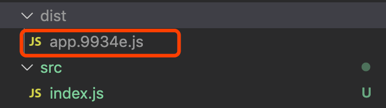
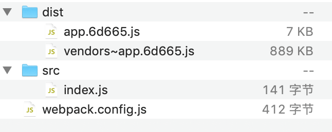
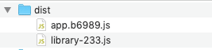
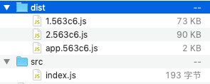
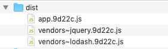
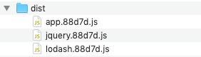

# code splitting

[中文文档](https://webpack.docschina.org/guides/code-splitting/)

code splitting 就是把代码分离到不同的 bundle 中，然后可以按需加载或并行加载这些文件

代码分离可以用于获取更小的 bundle，以及控制资源加载优先级，如果使用合理，会极大影响加载时间

例如在项目中使用 `lodash`

```javascript
import _ from 'lodash';

console.log(_.join(['Another', 'module', 'loaded!'], '-'));
```

打包后 lodash 会跟业务代码打包在同一个文件



而一般情况，项目中用到的一些库需要和业务代码分开，因为这些库很少改动，打包在一起会影响二次加载

另外，各个模块的代码也可能需要拆分，按需加载

如果首屏加载不需要加载整个项目的代码，这样特别影响性能

## 1 静态导入

```javascript
module.exports = {
  // ...
  optimization: {
    splitChunks: {
      chunks: 'all'
    }
  }
};
```

这个配置会把 `node_modules` 里面的模块跟业务代码分离，打包在同一个模块

比如业务代码中用了 lodash 和 jquery，那么它们会被打包在一个文件中



另外可以做一些文件的匹配，或者给打包后的文件命名:

```javascript
module.exports = {
  // ...
  optimization: {
    splitChunks: {
      chunks: 'all',
      cacheGroups: {
        vendors: {
          test: /[\\/]node_modules[\\/]/, // 只匹配 node_modules 中的文件
          filename: 'library-233.js' // 指定文件名
        }
      }
    }
  }
};
```

打包后文件：



## 2 动态导入 (dynamic import)

### 2.1 基本配置

动态导入，就是使用到的时候再去加载文件。可以实现按需加载，或者懒加载

```javascript
import('lodash').then(({ default: _ }) => {
  console.log(_.join(['Another', 'module', 'loaded!'], '-'));
});

import('jquery').then(({ default: $ }) => {
  console.log($.trim('  233  '));
});
```

动态导入在不做任何优化配置时，会分别打包到单独的文件



### 2.2 babel 配置

如果有用到 babel，需要另外使用一个 babel 插件 `@babel/plugin-syntax-dynamic-import` 才支持动态导入语法

```javascript
rules: [
  {
    test: /\.js$/,
    use: {
      loader: 'babel-loader',
      options: {
        presets: [['@babel/preset-env']],
        plugins: ['@babel/plugin-syntax-dynamic-import']
      }
    },
    exclude: '/node_modules/'
  }
];
```

## 3 给模块命名

上面打包出来的文件名是自动生成的 id，如 `1.563c6.js`

如要给打包出来的文件命名，可以使用魔法注释的方式

```javascript
import(/* webpackChunkName: "lodash" */ 'lodash').then(({ default: _ }) => {
  console.log(_.join(['Another', 'module', 'loaded!'], '-'));
});

import(/* webpackChunkName: "jquery" */ 'jquery').then(({ default: $ }) => {
  console.log($.trim('  233  '));
});
```

打包之后的文件：



但是文件名前面还加了一个 `vendors~`，这是因为 SplitChunksPlugin 有一些默认的配置

下面改一下 optimization 的配置

```javascript
module.exports = {
  // ...
  output: {
    path: path.resolve(__dirname, 'dist'),
    filename: '[name].[hash:5].js'
    // chunkFilename: '[name].[hash:5].js'
  },

  optimization: {
    splitChunks: {
      chunks: 'all',
      cacheGroups: {
        vendors: false,
        default: false
      }
    }
  }
};
```

可以看到打包后的文件名变了：



> 注意 output 的 filename 配置也对 splitChunks 生效。这里文件名的规则就是 output.filename。如果配置了 chunkFilename，则使用 chunkFilename 的配置

## 4 splitChunks 的默认配置

[splitChunks 文档](https://webpack.docschina.org/plugins/split-chunks-plugin)

```javascript
module.exports = {
  //...
  optimization: {
    splitChunks: {
      name: true, // 让 cacheGroups 设的名字可以生效
      chunks: 'async', // 只对异步代码做代码分割
      minSize: 20000, // 文件大于这个值的时候才会被抽取
      maxSize: 0, // 文件大于这个值会被分割成多个
      minChunks: 1, // 引用次数大于这个值才会被抽取
      minRemainingSize: 0,
      maxAsyncRequests: 6,
      maxInitialRequests: 4,
      automaticNameDelimiter: '~', // 文件名连接符
      enforceSizeThreshold: 50000,
      cacheGroups: {
        defaultVendors: {
          test: /[\\/]node_modules[\\/]/,
          priority: -10 // 优先级
        },
        default: {
          minChunks: 2,
          priority: -20,
          reuseExistingChunk: true
        }
      }
    }
  }
};
```

## 5 预加载

按需加载会在使用到相关文件的时候再去加载，这需要时间等待文件加载完成，可能会影响页面的体验

使用预加载可以预先加载文件，在使用到这个文件的时候不需要再花时间等待加载

prefetch(预获取)，preload(预加载)

```javascript
import(/* webpackPrefetch: true */ 'LoginModal');
```

prefetch、preload 区别：

- preload 会在父 chunk 加载时，以并行方式开始加载。prefetch chunk 会在父 chunk 加载结束后开始加载
- preload 具有中等优先级，并立即下载。prefetch chunk 在浏览器闲置时下载
- preload 会在父 chunk 中立即请求，用于当下时刻。prefetch chunk 会用于未来的某个时刻
