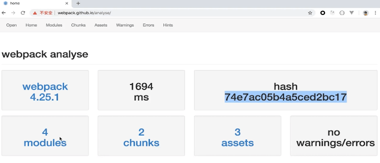
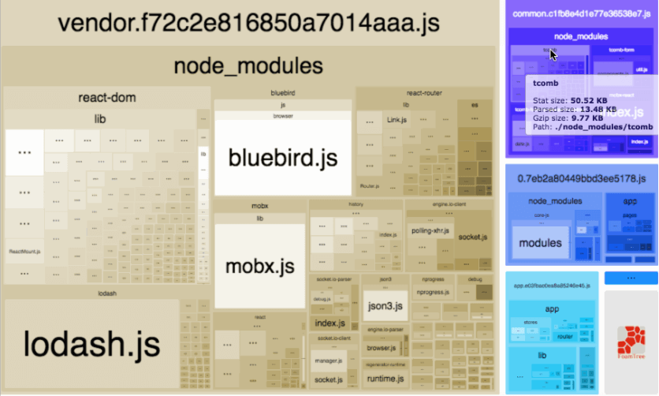

# 打包分析

[相关工具](https://webpack.docschina.org/guides/code-splitting/#bundle-analysis)

## 1 webpack 自带

在打包命令加配置参数

```
webpack --profile --json > stats.json --config ./xxx/webpack.config.js
```

打包后会生成一个 stats.json 文件，这个是对打包过程的描述文件，可读性比较差

需要借助工具分析 [https://webpack.github.io/analyse](https://webpack.github.io/analyse)



## 2 webpack-bundle-analyzer

一个 webpack 插件，它将 bundle 内容展示为一个便捷的、交互式、可缩放的树状图形式

```javascript
const BundleAnalyzerPlugin = require('webpack-bundle-analyzer').BundleAnalyzerPlugin;

module.exports = {
  plugins: [new BundleAnalyzerPlugin()]
};
```


