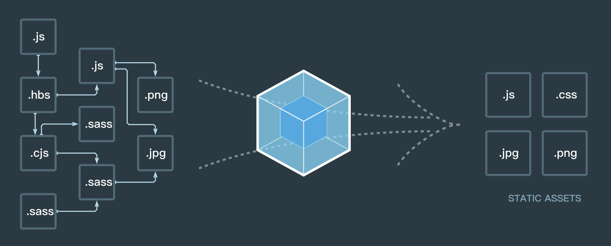

# 版本

## 1 概述

本质上，webpack 是一个现代 JavaScript 应用程序的静态模块打包器(module bundler)。当 webpack 处理应用程序时，它会递归地构建一个依赖关系图(dependency graph)，其中包含应用程序需要的每个模块，然后将所有这些模块打包成一个或多个 bundle

## 2 版本更迭

- webpack v1.0.0 -- 2014.02.20
- webpack v2.2.0 -- 2017.01.18
- webpack v3.0.0 -- 2017.06.19
- webpack v4.0.0 -- 2018.02.26
- webpack v4.41.6 -- 当前

## 3 功能进化

v1:

- 编译、打包
- 模块热更新
- 代码分割
- 文件处理

v2:

- tree shaking(会去除引入了但没用到的代码，打包后体积更小)
- ES Module(v1 版本需要 babel)
- 动态 import

v3:

- scope hoisting(作用域提升)(提高打包后代码的性能)(老版本打包后的模块都包裹在一个单独的闭包中，这对性能有损耗)(作用域提升会将所有模块的作用域提到单一的一个闭包中)
- magic comments(配合动态 improt 使用)(可以指定打包后的文件名)
