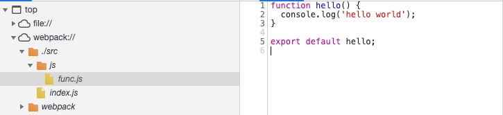

# source map

[webapck 官网文档](https://webpack.docschina.org/configuration/devtool/#devtool)

当 webpack 打包源代码时，可能会很难追踪到 error(错误) 和 warning(警告) 在源代码中的原始位置。例如，如果将三个源文件（a.js, b.js 和 c.js）打包到一个 bundle（bundle.js）中，而其中一个源文件包含一个错误，那么堆栈跟踪就会直接指向到 bundle.js。你可能需要准确地知道错误来自于哪个源文件，所以这种提示这通常不会提供太多帮助

为了更容易地追踪 error 和 warning，JavaScript 提供了 source map 功能，可以将编译后的代码映射回原始源代码

开启 sourcemap:

```javascript
module.exports = {
  devtool: 'source-map'
};
```

## 1 未启用 sourcemap

先看下未启用 sourcemap 的情况，来一个简单的 demo

```javascript
// func.js
// 输出一行文字
function hello() {
  console.log('hello world');
}

export default hello;
```

```javascript
// index.js
// 执行方法
import hello from './js/func';
hello();
```


然后在浏览器运行，可以看到提示的是在 `app.min.9d962.js` 文件的 106 行打印的文字，因为浏览器加载执行的是打包后的 js

而实际上，这行代码的位置是 `func.js` 的第 2 行


查看 js 文件，已经无法定位到代码的原始位置，基本无法调试

## 2 sourcemap 配置

sourcemap 有很多配置，不同的配置打包速度不同，适用的环境也不一样

### 2.1 source-map


这个配置会生成一个 source map 文件，并且在 js 文件下面注释标明 source map 文件的位置




在浏览器中可以准确的映射源文件

### 2.2 inline-source-map


`inline-source-map` 和 `source-map` 的区别就是，不另外生成 source map 文件

而是通过 DataUrl 的形式，放在打包的 js 文件中

### 2.3 cheap-source-map

source map 被简化为每行一个映射，无法定位到列，并且无法在列上面设置断点

> cheap 只映射业务代码，不映射第三方模块和 loader 的代码

先改下测试代码：

```javascript
// 一行代码中有两个语句，第二个 console 打印一个没有定义的变量，这里会报错
function hello() {
  console.log('hello world');
  console.log(noooo);
}
```


`source-map` 配置会在列的位置提示错误，并且可以在列上面打断点


`cheap-source-map` 的错误信息只能定位到行，并且无法在列上面打断点

### 2.4 cheap-module-source-map

> todo 待测试，module 会添加 loader 和第三方模块的 sourcemap

### 2.5 eval

eval 和 source map 是两中完全不同的方式

source map 是通过位置信息映射，可以完整的显示源代码

eval 模式会把每个 module 封装到 eval 里包裹起来执行，并且会在末尾追加注释

```javascript
function(module,exports,__webpack_require__){
  eval(
    ...
    //# sourceURL=webpack:///./src/js/index.js?'
  )
}
```


eval 模式在浏览器中看到的是转换过的代码，无法精确的定位错误
