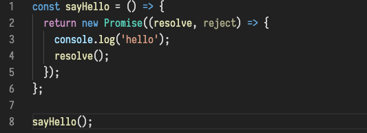
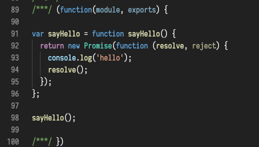

# babel

[babel 中文文档](https://babel.docschina.org)

## 1 babel 简介

`babel` 是一个运用广泛的工具，可以单独使用或者用在其他打包工具中，`webpack` 使用 `babel-loader`

javascript 在不断的发展，各种新的标准和提案层出不穷，但是由于浏览器的多样性，导致可能几年之内都无法广泛普及，babel 可以让你提前使用这些语言特性，他是一种用途很多的 javascript 编译器，他把最新版的 javascript 编译成当下可以执行的版本，简言之，利用 babel 就可以让我们在当前的项目中随意的使用这些新最新的 es6，甚至是未正式发布的新特性(stage 0-3)

### 1.1 babel 7 新特性(断崖式变更)

- 对那些已经不维护的 node 版本不予支持，包括 0.10、0.12、4、5
- Babel 团队会通过使用 “scoped” packages 的方式，来给自己的 babel package name 加上 @babel 命名空间（详情），这样以便于区分官方 package 以及 非官方 package，所以 babel-core 会变成 @babel/core
- 移除（并且停止发布）所有与 yearly 有关的 presets（preset-es2015 等）。@babel/preset-env 会取代这些 presets，这是因为 @babel/preset-env 囊括了所有 yearly presets 的功能，而且 @babel/preset-env 还具备了针对特定浏览器进行“因材施教”的能力
- 放弃 Stage presets（@babel/preset-stage-0 等），选择支持单个 proposal。相似的地方还有，会默认移除 @babel/polyfill 对 proposals 支持
- 有些 package 已经换名字：所有 TC39 proposal plugin 的名字都已经变成以 @babel/plugin-proposal 开头，替换之前的 @babel/plugin-transform。所以 @babel/plugin-transform-class-properties 变成 @babel/plugin-proposal-class-properties
- 针对一些用户会手动安装（user-facing）的 package（例如 babel-loader，@babel/cli 等），会给 @babel/core 加上 peerDependency

<a href="https://www.w3ctech.com/topic/2150" target="_blank">babel 7 新特性（原文链接）</a>

### 1.2 babel-core 和 @babel/core

`@babel/core` 是 babel 的核心库

> babel 7 更改了包名，Babel 团队通过使用 “scoped” packages 的方式，来给自己的 babel package name 加上 @babel 命名空间，这样以便于区分官方 package 以及 非官方 package，所以 babel-core 会变成 @babel/core

## 2 配置

```javascript
module: {
  rules: [
    {
      test: /\.js$/,
      use: 'babel-loader',
      exclude: '/node_modules/'
    }
  ];
}
```

上面是一个基础的配置，在实际项目中还需要配置 presets

### 2.1 presets

babel-loader 只是将 webpack 和 babel 打通，需要将语法转译还需要其他的模块 presets

presets 就是指定 babel-loader 按照哪个规范来编译

目前的规范：

- es2015
- es2016
- es2017
- env(常用，包括 es2015-es2017 和最近的版本)
- babel-preset-react
- babel-preset-stage 0-3(还没正式发布的几个阶段的规范)

```bash
# 安装
npm install @babel/preset-env --save-dev
```

### 2.2 polyfill

> preset 只能编译新规范的语法，但是不能编译函数和方法。es6 新增的函数和方法低版本的浏览器还是不能识别，需要使用 polyfill

例如：

- Promise
- Generator
- Set
- Map
- Array.from
- Array.prototype.includes

如图，只配置 preset，const 和箭头函数被编译的，但是 Promise 函数没有





Babel Polyfill 会在全局定义 es6 新增的函数和方法（会污染全局）

完整引入 polyfill:

```javascript
// 完整引入 polyfill
// 如果需要按需引入，在 presets 配置中配置 useBuiltIns: 'usage'
import '@babel/polyfill';

let index = [1, 2, 3, 4].findIndex(item => {
  return item === 3;
});

console.log(index);
```

按需引入 polyfill:

```javascript
module: {
  rules: [
    {
      test: /\.js$/,
      use: {
        loader: 'babel-loader',
        options: {
          // useBuiltIns: 'usage' 按需引入
          presets: [['@babel/preset-env', { useBuiltIns: 'usage' }]]
        }
      },
      exclude: '/node_modules/'
    }
  ];
}
```

### 2.3 transform-runtime

`import '@babel/polyfill'` 方式是在全局注入一些方法，会污染全局

在业务项目中使用没有问题，但是在写一些第三方库的时候不能用这种方式

transform-runtime 会以闭包的方式注入，不会污染全局

```javascript
module: {
  rules: [
    {
      test: /\.js$/,
      use: {
        loader: 'babel-loader',
        options: {
          plugins: [
            [
              '@babel/plugin-transform-runtime',
              {
                corejs: 2
              }
            ]
          ]
        }
      },
      exclude: '/node_modules/'
    }
  ];
}
```

### 2.4 targets 参数

编译时会根据指定的 targets 来选择哪些语法编译哪些不编译，包括语法的编译和 polyfill 的按需引入

- targets.browsers 指定哪些浏览器
- targets.browsers: "last 2 versions" 兼容主流浏览器的最后两个版本
- targets.browsers: "> 1%" 兼容全球占有率大于 1%的浏览器
- targets.node 指定 node 版本

> 数据来自 `browserslist` (一个开源项目)，和 `can i use`

```javascript
module: {
  rules: [
    {
      test: /\.js$/,
      use: {
        loader: "babel-loader",
        options: {
          presets: [
            [
              "@babel/preset-env",
              {
                targets: {
                  browsers: ["> 1%", "last 2 versions"] // 指定支持哪些浏览器
                  chrome: "52" // 指定chrome版本
                }
              }
            ]
          ]
        }
      },
      exclude: "/node_modules/"
    }
  ];
}
```
